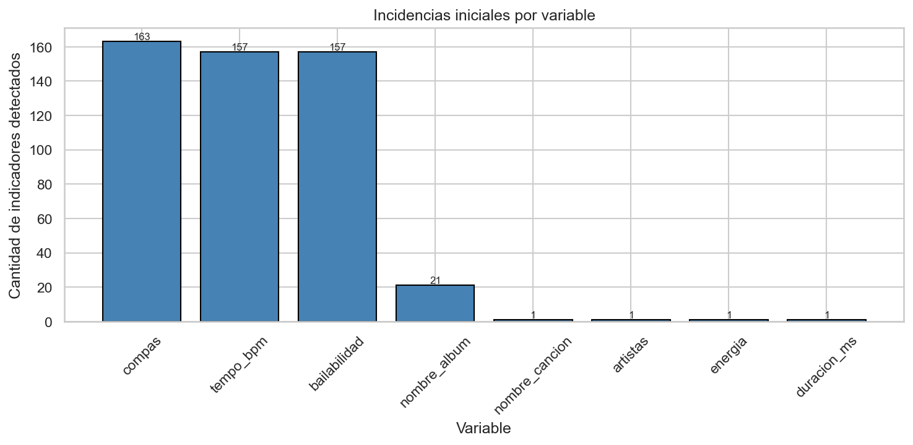
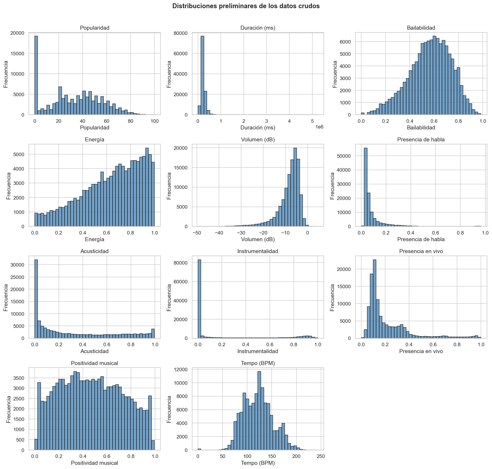
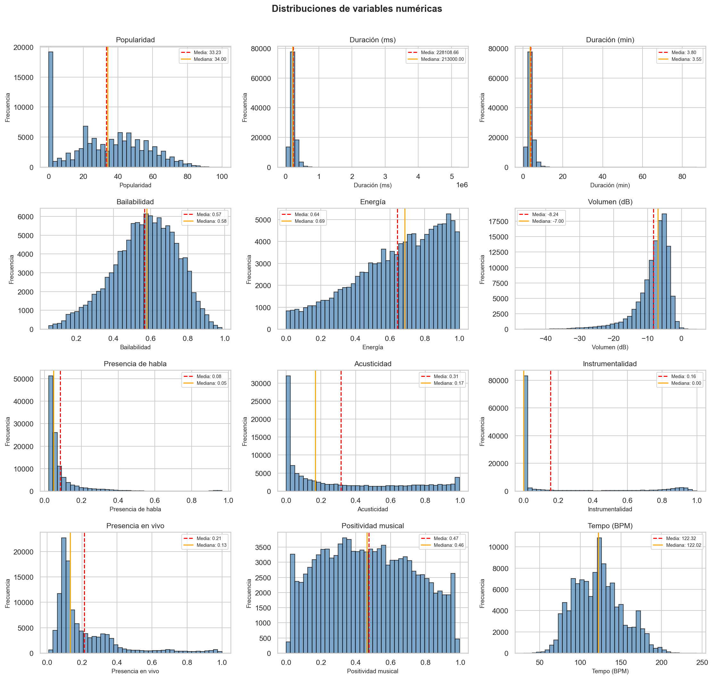
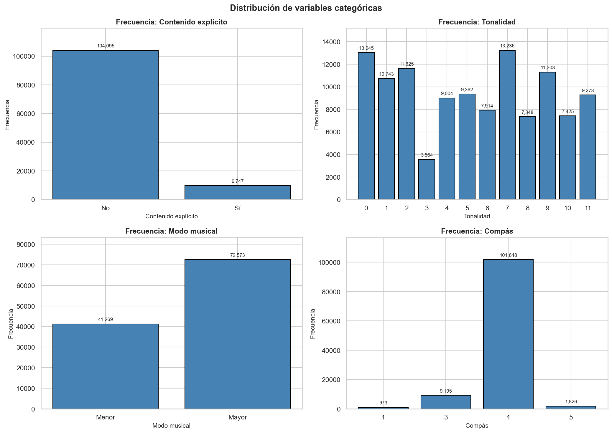
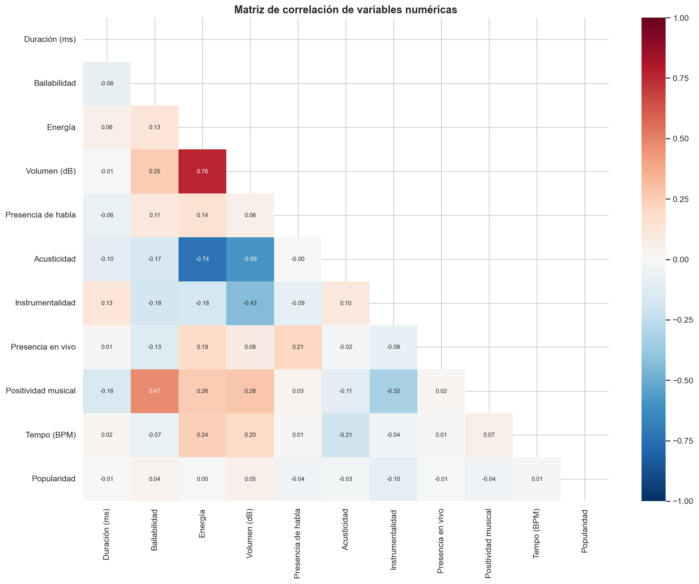
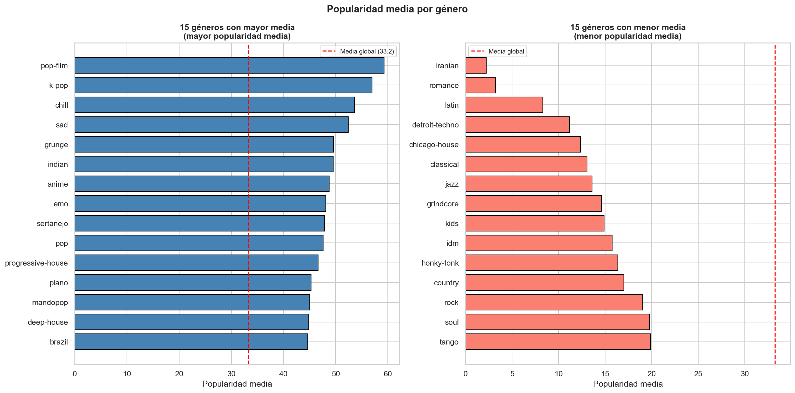
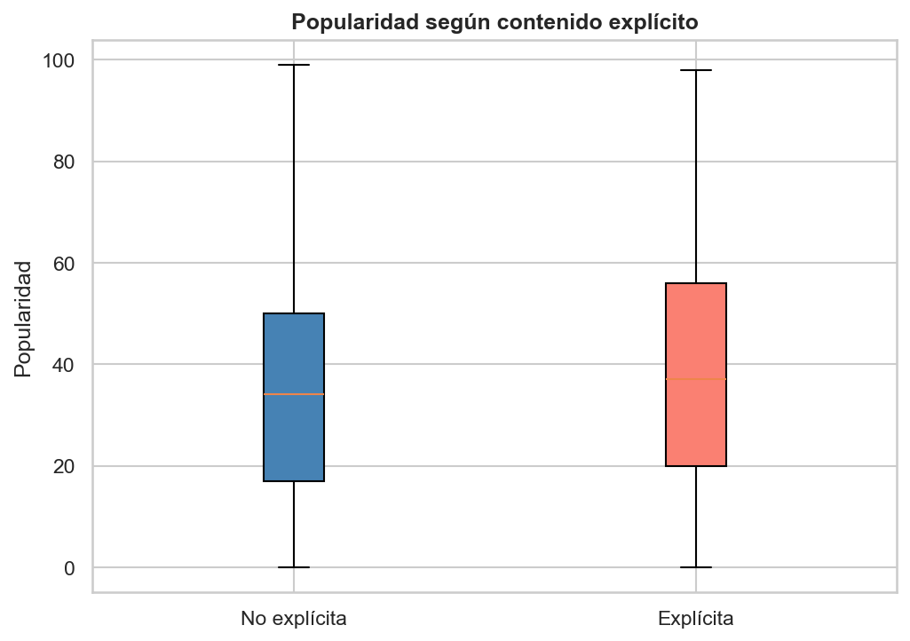

# 🎵 Inteligencia Musical y Predicción de Popularidad de Canciones

Proyecto desarrollado para la asignatura **Machine Learning (MLY1101)** de **Duoc UC**.

El proyecto analiza un conjunto de datos de canciones de Spotify con el objetivo de estudiar si sus características musicales permiten anticipar su nivel de popularidad.

---

## 👥 Integrantes

- Alejandra González
- Constanza González
- Diego Villar

**Docente:** Marco Japke  
**Institución:** Duoc UC  
**Asignatura:** Machine Learning — MLY1101  
**Caso:** C — Spotify Tracks  
**Metodología:** CRISP-DM  

---

# 📌 Descripción del proyecto

Spotify dispone de grandes cantidades de información asociada a canciones, artistas, géneros y características de audio.

El problema de negocio consiste en determinar si los **atributos medibles de una canción** permiten anticipar su nivel de popularidad en Spotify.

Entre las variables analizadas se encuentran:

- Bailabilidad
- Energía
- Volumen
- Tempo
- Acusticidad
- Instrumentalidad
- Presencia de habla
- Presencia en vivo
- Positividad musical
- Género musical
- Contenido explícito

La variable objetivo del proyecto es:

```text
popularidad
```

Esta variable se mide en una escala de **0 a 100**.

Debido a que la variable objetivo es numérica continua, el problema de Machine Learning se plantea como un problema de **regresión**.

El futuro modelo podría servir como apoyo para:

- Selección de canciones para playlists.
- Curaduría editorial.
- Decisiones de promoción.
- Identificación de patrones relacionados con popularidad.
- Toma de decisiones basada en datos.

---

# 🎯 Objetivos del proyecto

## Objetivo general

Construir una base analítica reproducible para desarrollar, en una etapa futura, un modelo de regresión que estime la popularidad de una canción a partir de sus atributos musicales medibles.

## Objetivos específicos

- Evaluar la calidad del dataset.
- Detectar valores nulos, anomalías e inconsistencias.
- Analizar la distribución de las variables.
- Estudiar la relación entre las variables predictoras y la popularidad.
- Preparar y transformar los datos para Machine Learning.
- Evitar fuga de información entre entrenamiento y prueba.
- Identificar posibles sesgos asociados a los datos y a las decisiones de limpieza.
- Construir un pipeline de preprocesamiento reproducible.

---

# 📊 KPIs del proyecto

Se definieron indicadores de calidad para esta primera etapa y métricas de desempeño para una futura etapa de modelamiento.

| KPI | Tipo | Meta | Estado EP1 |
|---|---|---:|---:|
| Cobertura de datos | Calidad | ≥ 99% | ✅ 99,86% |
| IDs compartidos entre TRAIN y TEST | Calidad | 0 | ✅ 0 |
| MAE | Modelo | < 10 | 🔄 EP2 |
| RMSE | Modelo | < 15 | 🔄 EP2 |
| R² | Modelo | > 0,20 | 🔄 EP2 |

> **Importante:** MAE, RMSE y R² corresponden a objetivos futuros. En esta entrega todavía no se entrena ni evalúa un modelo predictivo.

---

# 🔄 Metodología CRISP-DM

El proyecto sigue la metodología **CRISP-DM**, compuesta por seis fases.

| Fase | Estado |
|---|---|
| 1. Comprensión del negocio | ✅ Completa |
| 2. Comprensión de los datos | ✅ Completa |
| 3. Preparación de los datos | ✅ Completa |
| 4. Modelado | 🔄 EP2 |
| 5. Evaluación | 🔄 EP2 |
| 6. Despliegue | 🔄 Trabajo futuro |

En esta Evaluación Parcial N.º 1 se desarrollan principalmente las tres primeras fases de CRISP-DM.

---

# 📁 Fuente de datos

El dataset utilizado corresponde a:

**Spotify Tracks Dataset — Kaggle**

Características principales:

- **114.000 registros**
- **20 columnas útiles**
- **89.741 canciones únicas**
- **114 géneros musicales**
- Existen canciones asociadas a más de un género.

Una misma canción puede aparecer varias veces si está relacionada con distintas categorías musicales.

## Limitaciones de la fuente

El archivo utilizado no declara de forma explícita:

- Fecha de extracción.
- Versión de la API de Spotify.
- Criterio exacto de muestreo del catálogo.

Por este motivo, no es posible garantizar que los valores de popularidad representen el estado actual del catálogo de Spotify.

La popularidad es una variable que puede cambiar con el tiempo según el comportamiento de reproducción de los usuarios.

---

# 🛠️ Herramientas utilizadas

Durante el desarrollo del proyecto se utilizaron las siguientes herramientas:

| Herramienta | Uso |
|---|---|
| Python | Desarrollo del análisis |
| pandas | Manipulación de datos |
| NumPy | Operaciones numéricas |
| matplotlib | Visualización |
| seaborn | Visualización estadística |
| scikit-learn | Preparación de datos y pipeline |
| Jupyter Notebook | Desarrollo reproducible |
| Google Colab | Ejecución colaborativa |
| Git | Control de versiones |
| GitHub | Repositorio y trabajo colaborativo |

---

# 🧾 Variables principales

| Variable | Descripción | Tipo |
|---|---|---|
| `popularidad` | Popularidad de la canción | Target, 0–100 |
| `duracion_ms` | Duración de la canción | Numérica |
| `bailabilidad` | Qué tan adecuada es para bailar | Numérica, 0–1 |
| `energia` | Intensidad y actividad percibida | Numérica, 0–1 |
| `volumen_db` | Volumen promedio | Numérica, dB |
| `tempo_bpm` | Velocidad musical | Numérica, BPM |
| `presencia_habla` | Presencia de palabras habladas | Numérica, 0–1 |
| `acusticidad` | Nivel de características acústicas | Numérica, 0–1 |
| `instrumentalidad` | Presencia de contenido instrumental | Numérica, 0–1 |
| `presencia_en_vivo` | Probabilidad de grabación en vivo | Numérica, 0–1 |
| `positividad` | Positividad musical | Numérica, 0–1 |
| `contenido_explicito` | Indica contenido explícito | Categórica |
| `tonalidad` | Tonalidad musical | Categórica |
| `modo` | Modo mayor o menor | Categórica |
| `compas` | Compás musical | Categórica |
| `genero_musical` | Género musical | Categórica |
| `id_cancion` | Identificador de la canción | Excluir del modelo |

> `tonalidad`, `modo` y `compas` se consideran variables categóricas porque representan códigos musicales y no magnitudes continuas.

---

# 📏 Cómo se miden los datos

Las variables del proyecto utilizan diferentes escalas de medición.

| Variable | Medición |
|---|---|
| Popularidad | 0–100 |
| Bailabilidad | 0–1 |
| Energía | 0–1 |
| Acusticidad | 0–1 |
| Instrumentalidad | 0–1 |
| Presencia de habla | 0–1 |
| Presencia en vivo | 0–1 |
| Positividad musical | 0–1 |
| Volumen | Decibeles (dB) |
| Tempo | Beats Per Minute (BPM) |
| Duración | Milisegundos |
| Género | Categoría |
| Contenido explícito | Categoría |
| Tonalidad | Código musical |
| Compás | Código musical |

Para estudiar cómo estas variables se relacionan con la variable objetivo se utilizaron:

- Histogramas.
- Estadísticos descriptivos.
- Correlaciones para variables numéricas.
- Comparaciones por grupo para variables categóricas.
- Análisis de valores atípicos.
- Comparación de distribuciones.

---

# 🔍 Auditoría inicial de calidad

Antes de realizar la limpieza se analizaron separadamente:

- Valores nulos.
- Valores `"?"`.
- Textos vacíos.
- Valores iguales a cero.
- Valores fuera del dominio esperado.

Principales incidencias detectadas:

| Variable | Incidencias |
|---|---:|
| `compas` | 163 |
| `tempo_bpm` | 157 ceros |
| `bailabilidad` | 157 ceros |
| `nombre_album` | 20 `"?"` + 1 nulo |
| `energia` | 1 cero |
| `duracion_ms` | 1 cero |

Un valor igual a cero no fue tratado automáticamente como un dato faltante. Primero se evaluó el significado de cada variable.

## Gráfico de auditoría inicial



---

# 📊 Distribución preliminar de los datos

Antes de aplicar las reglas de preparación se estudiaron las distribuciones de las principales variables numéricas.



Este análisis permitió identificar:

- Distribuciones asimétricas.
- Concentraciones de valores.
- Posibles valores atípicos.
- Variables con fuerte presencia de ceros.
- Diferencias importantes entre escalas.

---

# 🧹 Limpieza y preparación de datos

Las principales reglas aplicadas fueron:

| Variable | Condición | Tratamiento |
|---|---|---|
| `artistas` | Nulo, vacío o `"?"` | Eliminar fila |
| `nombre_cancion` | Nulo, vacío o `"?"` | Eliminar fila |
| `nombre_album` | Nulo, vacío o `"?"` | Imputar `DESCONOCIDO` |
| `tempo_bpm` | Igual a 0 | Eliminar fila |
| `bailabilidad` | Igual a 0 | Eliminar fila |
| `energia` | Igual a 0 | Eliminar fila |
| `compas` | 0 o nulo | Imputar moda de TRAIN |
| `duracion_ms` | Cero, negativa o nula | Eliminar fila |

## Resultado de la limpieza

| Indicador | Resultado |
|---|---:|
| Filas originales | 114.000 |
| Filas eliminadas | 158 |
| Filas conservadas | 113.842 |
| Porcentaje conservado | **99,86%** |
| Álbumes imputados | 20 |
| Compases imputados | 6 |
| Moda de compás | 4 |

La eliminación de ceros en algunas características de audio corresponde a una **decisión metodológica del proyecto**.

Esta decisión puede modificar la representación de algunos géneros musicales y por esta razón su impacto se considera dentro del análisis de sesgos.

---

# 🚫 Prevención de Data Leakage

En el dataset existen:

- **114.000 filas**
- **89.741 canciones únicas**
- **16.641 canciones que aparecen asociadas a más de un género**

Si la división entre entrenamiento y prueba se realizara aleatoriamente por filas, una misma canción podría aparecer simultáneamente en ambos conjuntos.

Esto produciría **Data Leakage**.

Para evitarlo se utilizó:

```python
GroupShuffleSplit
```

agrupando por:

```python
id_cancion
```

El resultado de la partición fue:

```text
TRAIN: 91.072 filas
TEST: 22.770 filas
IDs compartidos entre TRAIN y TEST: 0
```

De esta manera, una canción completa queda solamente en uno de los conjuntos.

Además:

- La moda utilizada para imputar `compas` se aprende únicamente con TRAIN.
- El pipeline de preprocesamiento se ajusta únicamente con TRAIN.
- TEST se utiliza posteriormente sin participar en el aprendizaje de las transformaciones.

---

# 📈 Análisis exploratorio de datos

## Distribución de variables numéricas

Después de la preparación se analizaron nuevamente las variables numéricas.



Se evaluaron:

- Media.
- Mediana.
- Forma de la distribución.
- Asimetría.
- Valores extremos.
- Diferencias de escala.

---

# 🎼 Variables categóricas

También se analizaron las distribuciones de variables categóricas como:

- Contenido explícito.
- Tonalidad.
- Modo musical.
- Compás.



---

# 🔗 Relación entre variables y popularidad

Uno de los principales objetivos del EDA fue estudiar cómo se relacionan las variables predictoras con la variable objetivo:

```text
popularidad
```

Para las variables numéricas se utilizaron correlaciones.

## Matriz de correlación



Principales correlaciones con `popularidad`:

| Variable | Correlación |
|---|---:|
| Instrumentalidad | -0,096 |
| Volumen | +0,052 |
| Presencia de habla | -0,045 |
| Positividad musical | -0,040 |
| Bailabilidad | +0,037 |
| Acusticidad | -0,026 |

## Hallazgo principal

Ninguna característica de audio individual presenta una **correlación lineal fuerte con popularidad**.

Esto significa que ninguna de estas variables, analizada de forma independiente, explica fuertemente el comportamiento de la variable objetivo.

Sin embargo, esto no descarta:

- Relaciones no lineales.
- Interacciones entre variables.
- Efectos combinados.
- Influencia del género musical.
- Relaciones que puedan ser detectadas por modelos más complejos.

---

# 🔗 Correlaciones entre variables predictoras

Aunque las correlaciones con popularidad son débiles, existen relaciones importantes entre algunas variables predictoras.

Entre las más relevantes:

```text
Energía ↔ Volumen ≈ +0,76
Energía ↔ Acusticidad ≈ -0,74
```

Esto indica que:

- Las canciones con mayor energía tienden a presentar un volumen mayor.
- Las canciones con mayor energía tienden a presentar menor acusticidad.

Estas relaciones corresponden a asociaciones entre variables predictoras y no deben confundirse con relaciones directas con la popularidad.

---

# 🎧 Popularidad según género musical

Para estudiar variables categóricas se comparó la popularidad entre diferentes grupos.



La popularidad media global del dataset es aproximadamente:

```text
33,2
```

Se observan diferencias importantes entre géneros.

Algunos de los géneros con mayor popularidad media incluyen:

- `pop-film`
- `k-pop`
- `chill`
- `sad`
- `grunge`

Mientras que otros presentan una popularidad media considerablemente menor.

> Estas diferencias muestran una asociación entre género y popularidad, pero no permiten afirmar una relación causal.

---

# 🔞 Popularidad según contenido explícito

También se analizó la distribución de la popularidad según si la canción presenta contenido explícito.



El gráfico permite observar diferencias en la distribución de popularidad entre:

- Canciones no explícitas.
- Canciones explícitas.

Sin embargo, estas diferencias no demuestran que el contenido explícito sea la causa de una mayor o menor popularidad.

---

# 📌 Outliers

Durante el análisis se utilizó el criterio del rango intercuartílico **IQR** para detectar posibles valores atípicos.

Los outliers no fueron eliminados automáticamente.

La razón es que un valor extremo no necesariamente representa un error.

Por ejemplo:

- Una canción puede tener una duración considerablemente mayor que el promedio.
- Una canción puede tener instrumentalidad cercana a 1.
- Una canción puede tener características de audio poco comunes y seguir siendo un registro válido.

Por lo tanto, los outliers fueron analizados antes de decidir cualquier tratamiento.

---

# ⚖️ Sesgos detectados

Durante el proceso de limpieza se identificó un efecto importante.

De las **157 filas eliminadas por ceros en tempo, bailabilidad o energía**:

```text
138 pertenecían al género "sleep".
```

Esto equivale aproximadamente a:

```text
88%
```

Por lo tanto, la regla de limpieza afecta de forma desproporcionada a este género.

Esto representa un posible sesgo porque reduce su representación dentro del conjunto de datos utilizado posteriormente.

---

# ⚠️ Otros riesgos éticos

También se identificaron otros riesgos asociados al futuro uso de un modelo predictivo.

## Popularidad histórica

La popularidad puede estar influenciada por decisiones anteriores de:

- Promoción.
- Playlists.
- Algoritmos de recomendación.
- Exposición editorial.

Por lo tanto, un modelo podría aprender y reproducir patrones que ya existen dentro de la plataforma.

## Ciclo de retroalimentación

Si una canción recibe una predicción alta y posteriormente obtiene mayor exposición por esa razón, su popularidad podría aumentar.

Esto podría reforzar las predicciones originales y favorecer sistemáticamente ciertos tipos de contenido.

## Popularidad no equivale a calidad artística

El objetivo de un futuro modelo sería estimar popularidad.

No debe utilizarse como una medida directa de:

- Calidad musical.
- Valor artístico.
- Mérito de un artista.

Por esta razón se recomienda mantener supervisión humana en futuras aplicaciones.

---

# 🔐 Privacidad

El dataset actual no contiene:

- Historiales de reproducción de usuarios.
- Perfiles personales.
- Ubicación.
- Información privada individual.
- Preferencias individuales identificables.

El dataset contiene principalmente información y características asociadas a canciones.

Por lo tanto, el riesgo actual de privacidad individual es considerado **bajo**.

Si en una etapa futura se incorporaran datos de usuarios, sería necesario considerar principios de:

- Minimización de datos.
- Protección de información personal.
- Uso responsable.
- Consentimiento.
- Cumplimiento de normativa aplicable.

---

# ⚙️ Pipeline de preparación para Machine Learning

El proyecto deja preparado un pipeline de transformación mediante `ColumnTransformer`.

## Variables numéricas

Las variables numéricas utilizan:

```python
StandardScaler()
```

## Variables categóricas

Las variables categóricas utilizan:

```python
OneHotEncoder(handle_unknown="ignore")
```

## Compás

La variable `compas` utiliza:

```python
SimpleImputer(strategy="most_frequent")
```

seguido de:

```python
OneHotEncoder(handle_unknown="ignore")
```

El flujo general es:

```text
Variables numéricas
        ↓
 StandardScaler
        │
        │
Variables categóricas
        ↓
 OneHotEncoder
        │
        │
      Compás
        ↓
 SimpleImputer
        ↓
 OneHotEncoder
        │
        ▼
 ColumnTransformer
        ↓
 Datos preparados
```

El pipeline se ajusta utilizando exclusivamente los datos de entrenamiento.

> En EP1 el pipeline queda construido y verificado, pero todavía no se entrena ningún modelo predictivo.

---

# 📂 Estructura del proyecto

```text
Machine-Learning-Spotify/
│
├── data/
│   ├── raw/
│   │   └── Spotify_Tracks_Dataset.csv
│   │
│   └── processed/
│       ├── spotify_clean.csv
│       ├── spotify_base_modelo.csv
│       ├── auditoria_faltantes.csv
│       ├── resumen_eliminacion.csv
│       ├── balance_limpieza.csv
│       ├── filas_descartadas.csv
│       ├── particion_modelo.csv
│       ├── outliers_iqr_summary.csv
│       └── variables_modelo.csv
│
├── notebooks/
│   └── EP1_Spotify_CRISP_DM_COMPLETO.ipynb
│
├── images/
│   ├── 00_calidad_datos_crudos.png
│   ├── 00_distribuciones_crudas.png
│   ├── 01_histogramas_numericas.png
│   ├── 02_variables_categoricas.png
│   ├── 03_matriz_correlacion.png
│   ├── 04_popularidad_por_genero.png
│   └── 05_popularidad_explicit.png
│
├── models/
│   └── reservado para EP2
│
└── README.md
```

---

# ▶️ Ejecución del proyecto

## 1. Clonar el repositorio

```bash
git clone https://github.com/ritnight/machine-learning-spotify
```

Entrar a la carpeta del proyecto:

```bash
cd Machine-Learning-Spotify
```

---

## 2. Instalar dependencias

```bash
pip install pandas numpy matplotlib seaborn scikit-learn jupyter
```

---

## 3. Ejecutar Jupyter Notebook

```bash
jupyter notebook
```

Luego abrir:

```text
notebooks/EP1_Spotify_CRISP_DM_COMPLETO.ipynb
```

Para reproducir correctamente el proyecto se recomienda ejecutar el notebook completo desde el inicio mediante:

```text
Restart Kernel and Run All
```

---

# ✅ Principales resultados de EP1

- Se analizaron **114.000 registros**.
- Se conservaron **113.842 filas**.
- Se mantuvo el **99,86%** del dataset después de la limpieza.
- Se eliminaron únicamente **158 filas**.
- Se imputaron **20 nombres de álbum** como `DESCONOCIDO`.
- Se imputaron **6 valores de compás**.
- La moda de compás utilizada fue **4**.
- Se utilizaron **91.072 filas para TRAIN**.
- Se utilizaron **22.770 filas para TEST**.
- Se obtuvo **0 solapamiento de IDs** entre TRAIN y TEST.
- Las correlaciones individuales con popularidad son débiles.
- Existen relaciones importantes entre algunas variables predictoras.
- Se detectó un posible sesgo de limpieza relacionado con el género `sleep`.
- El pipeline queda preparado para comenzar la fase de modelado.

---

# 🚀 Próximos pasos — EP2

En la siguiente etapa del proyecto se plantea:

1. Entrenar modelos supervisados de regresión.
2. Construir un modelo baseline.
3. Comparar diferentes algoritmos.
4. Evaluar el desempeño sobre el conjunto de prueba.
5. Utilizar las métricas:
   - MAE
   - RMSE
   - R²
6. Comparar resultados contra el baseline.
7. Evaluar errores según género musical.
8. Cuantificar posibles sesgos del modelo.
9. Seleccionar el modelo con mejor desempeño.
10. Analizar su posible aplicación al problema de negocio.

---

# 📌 Conclusiones

1. La auditoría inicial permitió detectar y separar correctamente diferentes tipos de incidencias.

2. La limpieza conservó el **99,86% de los registros**, manteniendo prácticamente todo el dataset original.

3. La partición mediante `GroupShuffleSplit` por `id_cancion` evitó que una misma canción apareciera simultáneamente en TRAIN y TEST.

4. El solapamiento entre identificadores de entrenamiento y prueba fue **0**.

5. Ninguna característica individual de audio presenta una correlación lineal fuerte con popularidad.

6. Las correlaciones débiles no descartan relaciones no lineales ni interacciones entre variables.

7. Existen diferencias de popularidad entre géneros musicales.

8. Se detectó un posible sesgo de limpieza, ya que aproximadamente el **88% de las eliminaciones por ceros de audio pertenecen al género `sleep`**.

9. El proyecto deja construido un pipeline reproducible y preparado para comenzar el modelado en EP2.

10. En esta entrega **no se entrena ni evalúa ningún modelo predictivo**.

---

# 📚 Contexto académico

**Duoc UC — 2026**  
**Asignatura:** Machine Learning — MLY1101  
**Evaluación Parcial N.º 1**  
**Caso C:** Inteligencia musical y predicción de popularidad de canciones  

### Integrantes

- Alejandra González
- Constanza González
- Diego Villar

### Docente

**Marco Japke**
