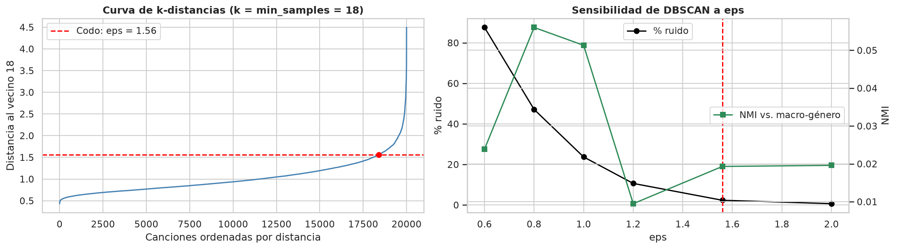
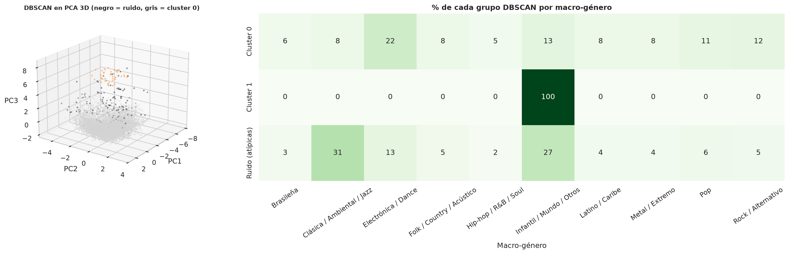

# 🎵 Inteligencia Musical y Predicción de Popularidad de Canciones

Proyecto desarrollado para la asignatura **Machine Learning (MLY1101)** de **Duoc UC**.

El proyecto analiza un conjunto de datos de canciones de Spotify para estudiar si los atributos medibles de una canción y el historial de su artista permiten anticipar su popularidad. También busca descubrir patrones útiles para la curaduría musical: perfiles sonoros, nichos y canciones atípicas.

| | |
|---|---|
| **Integrantes** | Alejandra González, Constanza González, Diego Villar |
| **Docente** | Marco Japke |
| **Caso** | C — Spotify Tracks |
| **Metodología** | CRISP-DM |
| **Entrega actual** | Evaluación Parcial N.º 2 (modelamiento y evaluación) |
| **Notebook principal** | [`notebooks/EP2_Spotify_CRISP_DM_Modelado.ipynb`](notebooks/EP2_Spotify_CRISP_DM_Modelado.ipynb) |
| **Notebook EP1 (histórico)** | [`notebooks/EP1_Spotify_CRISP_DM_COMPLETO.ipynb`](notebooks/EP1_Spotify_CRISP_DM_COMPLETO.ipynb) |

---

## Resumen ejecutivo

| Tarea | Mejor modelo | Resultado en prueba | Baseline |
|---|---|---|---|
| Regresión (popularidad 0–100) | HistGradientBoosting | **MAE 9,24 · RMSE 14,21 · R² 0,52** | MAE 17,17 · R² 0,00 |
| Clasificación (bajo / medio / alto) | Random Forest + sobremuestreo (ROS) | **Accuracy 0,77 · F1 macro 0,72 · Recall "alto" 0,61 · AUC 0,91** | F1 macro 0,21 |
| No supervisado 1 | K-Means (k = 7 perfiles sonoros) | Silueta 0,19 (prueba), estabilidad ARI 0,996 | — |
| No supervisado 2 | DBSCAN (eps = 1,56, min_samples = 18) | 1 nicho (comedia) + 2,3% de canciones atípicas | — |

**Hallazgos principales**

- **El artista es el predictor más importante, seguido por el género.** El audio por sí solo explica ~10% de la varianza de la popularidad. Con género se llega a ~38%, y con género + artista a ~52%.
- **El clasificador sirve para priorizar.** Entre el **1% de canciones con mayor probabilidad de "alto", el 93% es realmente popular** (8 veces la tasa base de 11%).
- **Todos los KPIs se cumplen.** Matiz: para artistas nuevos (28% de la prueba) el MAE es 11,3, mientras que para artistas conocidos es 8,4.
- **K-Means** segmenta el catálogo en 7 perfiles interpretables. **DBSCAN** muestra que el audio es un continuo sin grupos separados: solo aísla un nicho de contenido hablado y un 2–3% de canciones atípicas.

---

# 1. Descripción del problema de negocio

Un equipo de inteligencia musical necesita saber si los **atributos medibles de una canción** (audio, género, contenido explícito) y el **historial de su artista** permiten anticipar su nivel de popularidad en Spotify. El objetivo es apoyar:

- la curaduría editorial y el armado de playlists;
- la priorización de lanzamientos para escucha y promoción;
- la organización del catálogo en segmentos y nichos manejables.

La popularidad es una variable de **0 a 100** calculada por Spotify. Se aborda de dos formas complementarias:

- como **regresión**: estimar el valor de popularidad;
- como **clasificación**: estimar el nivel bajo / medio / alto, que es más accionable.

# 2. Objetivos del proyecto

**Objetivo general.** Desarrollar, comparar y evaluar modelos de Machine Learning que estimen la popularidad de una canción, y descubrir mediante aprendizaje no supervisado patrones útiles para la curaduría.

**Objetivos específicos**

1. Asegurar una base de datos limpia, auditable y **sin fuga de información** (EP1, revisada en EP2).
2. Entrenar y comparar **4 modelos de regresión** contra un baseline.
3. Entrenar y comparar **4 modelos de clasificación**, evaluando **distintos métodos de balanceo**.
4. Segmentar el catálogo en **perfiles sonoros** (K-Means).
5. Detectar **nichos densos y canciones atípicas** (DBSCAN).
6. Cuantificar sesgos del modelo (error por género) y traducir los resultados en recomendaciones.

# 3. KPIs

Todos los umbrales se fijaron **antes** de evaluar sobre el conjunto de prueba.

| KPI | Tipo | Umbral | Resultado | Cumple |
|---|---|---|---:|:---:|
| Cobertura de datos | Calidad | ≥ 99% | 99,86% | ✅ |
| Canciones (artista + título) compartidas train/test | Calidad | 0 | 0 | ✅ |
| MAE (HistGradientBoosting) | Regresión | < 10 | 9,24 | ✅ |
| RMSE (HistGradientBoosting) | Regresión | < 15 | 14,21 | ✅ |
| R² (HistGradientBoosting) | Regresión | > 0,20 | 0,521 | ✅ |
| Accuracy (Random Forest) | Clasificación | > 0,50 | 0,772 | ✅ |
| F1 macro (Random Forest) | Clasificación | > 0,45 | 0,720 | ✅ |
| Recall clase "alto" (Random Forest) | Clasificación | ≥ 0,60 | 0,613 | ✅ |
| Silueta K-Means (prueba) | No supervisado | ≥ 0,15 | 0,192 | ✅ |

En la versión sin artista no se cumplían el MAE (11,05), el RMSE (15,77) ni el recall de "alto" (0,51). Esos resultados se conservan en `data/processed/*_sin_artista.csv`.

**Matiz:** para canciones de artistas que no aparecen en entrenamiento, el MAE es 11,3, por encima del umbral. El cumplimiento global depende de que la mayoría de los lanzamientos sean de artistas con historial.

# 4. Fuente de datos

**Spotify Tracks Dataset — Kaggle** (`data/raw/Spotify_Tracks_Dataset.csv`)

- 114.000 filas, 20 columnas útiles, 89.741 IDs de canción, **114 géneros**.
- Una canción aparece una vez por cada género asociado.
- **Limitaciones:** el dataset no declara fecha de extracción ni versión de la API, y la popularidad cambia en el tiempo. Uso académico; no se distribuye audio.

| Variable | Tipo | Rol |
|---|---|---|
| `popularidad` | 0–100 | **Target** (regresión y, discretizada, clasificación) |
| `duracion_ms`, `bailabilidad`, `energia`, `volumen_db`, `presencia_habla`, `acusticidad`, `instrumentalidad`, `presencia_en_vivo`, `positividad`, `tempo_bpm` | Numéricas | Predictoras |
| `contenido_explicito`, `tonalidad`, `modo`, `compas` | Categóricas (códigos) | Predictoras (one-hot) |
| `genero_musical` | Categórica, 114 valores | Predictora (**multi-hot**: 114 columnas binarias) |
| `artistas` | Texto, 31.388 valores | Predictora (**target encoding**, ver 6.3) |
| `id_cancion`, `nombre_album`, `nombre_cancion` | Texto | Identificadores (no se usan como predictoras; el título solo agrupa reediciones) |

# 5. Metodología CRISP-DM

| Fase | Contenido | Estado |
|---|---|---|
| 1. Comprensión del negocio | Problema, objetivos, KPIs | ✅ (actualizada en EP2) |
| 2. Comprensión de los datos | Auditoría de calidad, distribuciones, correlaciones | ✅ EP1 |
| 3. Preparación de los datos | Limpieza, EDA, representación multi-hot, partición sin fuga, codificación del artista, targets | ✅ (corregida en EP2) |
| 4. Modelado | 4 regresiones, 4 clasificaciones + balanceo, K-Means, DBSCAN | ✅ EP2 |
| 5. Evaluación | Métricas en prueba, KPIs, importancia de variables, sesgo por género | ✅ EP2 |
| 6. Despliegue | Modelos serializados en `models/`, propuesta de uso y monitoreo | 🟡 Propuesta |

## 5.1 Revisión del EP1 y correcciones aplicadas

| # | Problema en EP1 | Corrección en EP2 |
|---|---|---|
| 1 | El README planteaba regresión y el notebook clasificación, con KPIs distintos. | Se abordan ambas tareas, con KPIs unificados. |
| 2 | Partición agrupada solo por `id_cancion`. **4.737 pares artista + título tienen varios IDs** (reediciones; 49% con audio idéntico). **1.894** de ellos habrían quedado a la vez en train y test (**fuga de información**). | La partición (`GroupShuffleSplit`) y la validación cruzada (`GroupKFold`) se agrupan por `clave_cancion` = artista + título normalizados. |
| 3 | El modelado usaba una fila por canción-género, lo que sobrerrepresenta a 16.299 canciones con varios géneros. | **1 canción = 1 fila**, con géneros codificados en *multi-hot*. |
| 4 | La tabla multi-género se construía con el compás ya imputado fuera del pipeline. | Se construye desde `df_base`, y la moda se aprende dentro del pipeline en cada pliegue. |
| 5 | Target de clasificación por **terciles** (cortes 23 y 43): con eso, una canción con popularidad 45 era "alta". | **Umbrales de negocio fijos**: bajo < 30, medio 30–59, alto ≥ 60. Al no aprenderse de los datos, no generan fuga. |
| 6 | Ruta del CSV relativa fija (fallaba fuera de `notebooks/`). | Búsqueda automática de la ruta. |
| 7 | Celdas vacías, desordenadas o con referencias erróneas. | Completadas y reordenadas. |

## 5.2 Decisiones de diseño del equipo (versión 2)

| Decisión | Implementación |
|---|---|
| **Incluir el artista** en el pipeline, por su influencia en la popularidad | *Target encoding* suavizado con *cross-fitting*; en colaboraciones se usa el máximo entre artistas. Se compara siempre con el modelo sin artista. |
| **K-Means y DBSCAN** como modelos no supervisados (requisito de la asignatura) | DBSCAN reemplaza al clustering jerárquico de la versión anterior. |

Las **reglas de limpieza de la EP1 se mantienen**: 158 filas eliminadas (99,86% conservado), 20 álbumes imputados y la moda de compás. Su justificación está en el notebook (sección 3.1).

# 6. Preparación y análisis exploratorio (EDA)

## 6.1 Calidad y limpieza (EP1)

| Variable | Condición | Tratamiento |
|---|---|---|
| `artistas`, `nombre_cancion` | Nulo, vacío o `?` | Eliminar fila |
| `nombre_album` | Nulo, vacío o `?` | Imputar `DESCONOCIDO` |
| `tempo_bpm`, `bailabilidad`, `energia` | Igual a 0 | Eliminar fila (decisión metodológica; afecta sobre todo a `sleep`) |
| `compas` | 0 o nulo | Moda aprendida **solo en entrenamiento** (dentro del pipeline) |
| `duracion_ms` | ≤ 0 o nula | Eliminar fila |
| Outliers (IQR) | — | Se detectan pero **no se eliminan**: son valores musicales válidos |


## 6.2 Hallazgos del EDA

- **Ninguna variable de audio tiene correlación lineal fuerte con la popularidad** (|r| < 0,10). La más alta en valor absoluto es instrumentalidad (−0,096).
- Entre predictoras hay multicolinealidad: energía ↔ volumen ≈ +0,76 y energía ↔ acusticidad ≈ −0,74. Se maneja con regularización en los modelos lineales.
- **La popularidad media varía mucho entre géneros** (pop-film y k-pop arriba; iranian y romance abajo).
- **10,6% de las canciones tiene popularidad 0.** Muchas son reediciones de una canción que sí es popular con otro ID; es ruido propio de la fuente.

| | |
|---|---|
|  |  |

## 6.3 Base de modelamiento (EP2)

- **89.583 canciones** (1 fila por ID), con 10 numéricas, 4 categóricas, 114 columnas de género y el artista.
- Partición **80/20 agrupada por artista + título**: 71.740 canciones en entrenamiento y 17.843 en prueba, con 0 claves y 0 IDs compartidos.
- **Pipeline** (`ColumnTransformer`, ajustado solo con los pliegues de entrenamiento):
  - numéricas → `StandardScaler`;
  - categóricas → `SimpleImputer(most_frequent)` + `OneHotEncoder`;
  - géneros → `passthrough`;
  - **artista** → `CodificadorArtista` + `StandardScaler`.

  Resultado: 145 columnas.

### Codificación del artista

El artista tiene **31.388 valores** y el 64% aparece con una sola canción, así que un one-hot no es viable. El equipo evaluó cuatro opciones (target encoding, frecuencia, one-hot de los artistas frecuentes y la combinación) y eligió **target encoding** (`src/transformadores.py`):

- **Valor del artista:** `(suma de popularidad + 10 · media global) / (n.º de canciones + 10)`. El suavizado acerca a la media global a los artistas con pocas canciones.
- **Colaboraciones (25% de las canciones):** se toma el **máximo** entre los artistas.
- **Artista nuevo:** recibe la media global.
- **Sin fuga:** al ajustar se usa *cross-fitting* (5 pliegues agrupados por artista + título), así que una canción nunca codifica su propia popularidad. El codificador vive dentro del pipeline, por lo que se reajusta en cada pliegue de la validación cruzada.
- **Clasificación:** se codifica el nivel ordinal medio del artista (bajo = 0, medio = 1, alto = 2).

**Targets:**
- **Regresión:** `popularidad`.
- **Clasificación:** `bajo` (0–29) 45%, `medio` (30–59) 44%, `alto` (≥ 60) **11%**. Es un problema desbalanceado.


# 7. Modelado

**Validación:** `GroupKFold` de 3 pliegues por artista + título, solo con los datos de entrenamiento. Los hiperparámetros se ajustan con `RandomizedSearchCV`. El preprocesamiento y el balanceo van dentro del pipeline, y el conjunto de prueba se usa **una sola vez**.

## 7.1 Regresión: 4 modelos

| Modelo | Por qué se incluye | Mejores hiperparámetros | MAE CV | R² CV |
|---|---|---|---:|---:|
| Baseline (media) | Referencia mínima | — | 17,27 | 0,00 |
| **Ridge** | Lineal, interpretable; la L2 controla la multicolinealidad | `alpha=10` | 10,62 | 0,460 |
| **KNN** | Hipótesis "canciones similares → popularidad similar" | `k=10`, `weights=distance` | 11,08 | 0,397 |
| **Random Forest** | *Bagging*: no linealidad, interacciones, robusto a outliers | `max_features=0.33`, `min_samples_leaf=5` | 9,68 | 0,497 |
| **HistGradientBoosting** | *Boosting*: estado del arte en datos tabulares, eficiente | `lr=0.03`, `max_iter=600`, `max_leaf_nodes=63` | **9,42** | **0,502** |


**Aporte del artista** (HistGradientBoosting, CV):

| Variables | MAE | R² |
|---|---:|---:|
| Solo audio + categóricas | 15,63 | 0,105 |
| + género | 11,59 | 0,383 |
| + artista (sin género) | 10,81 | 0,421 |
| **+ género + artista** | **9,69** | **0,497** |

El artista es la variable más informativa por sí sola, y combinado con el género da el mejor resultado.

## 7.2 Clasificación: 4 modelos y comparación de métodos de balanceo

Se probaron **5 métodos de balanceo × 4 modelos**. El remuestreo se aplicó solo a los pliegues de entrenamiento y después del preprocesamiento.

| Método | F1 macro promedio | Recall "alto" promedio | Comentario |
|---|---:|---:|---|
| Sin balanceo | 0,677 | 0,336 | Alta accuracy, pero detecta poco la clase "alto" |
| `class_weight='balanced'` | **0,693** | 0,725 | Mejor promedio; no agranda los datos (no aplica a KNN) |
| Submuestreo (RUS) | 0,666 | **0,739** | Descarta ~70% de los datos |
| Sobremuestreo (ROS) | 0,678 | 0,696 | Mejor F1 en Random Forest |
| SMOTE | 0,670 | 0,684 | Mejor F1 en HistGradientBoosting |

SMOTENC se evaluó en la versión sin artista: no superó a SMOTE y tardó ~16 veces más. Con el artista como categórica de 31.000 valores sería inviable.


Cada modelo se ajustó con su mejor método (criterio: F1 macro en CV):

| Modelo | Balanceo | Mejores hiperparámetros | F1 macro CV | Recall "alto" CV |
|---|---|---|---:|---:|
| Baseline (clase mayoritaria) | — | — | 0,208 | 0,000 |
| **Regresión logística** | Sin balanceo | `C=10` | 0,672 | 0,319 |
| **KNN** | Sin balanceo | `k=15`, `weights=uniform` | 0,637 | 0,282 |
| **Random Forest** | ROS | `max_features=sqrt`, `min_samples_leaf=3` | **0,719** | **0,623** |
| **HistGradientBoosting** | SMOTE | `lr=0.03`, `max_iter=600`, `max_leaf_nodes=63` | **0,719** | 0,536 |

Random Forest y HistGradientBoosting empatan en F1 macro. Se elige **Random Forest** por su mayor recall de "alto" en CV, que es el criterio de negocio.

## 7.3 No supervisado 1 — K-Means: perfiles sonoros

- **Objetivo:** segmentar las canciones por **sonido** para crear playlists por contexto, identificar los perfiles con más tracción y contrastar el sonido con las etiquetas de género.
- **Variables:** las 9 de audio, estandarizadas (sin popularidad ni género).
- **Elección de k:** codo + silueta, dentro de un rango de negocio de 4 a 8 perfiles → **k = 7**.

| Perfil | Rasgos | % catálogo | Pop. media | % "alto" |
|---|---|---:|---:|---:|
| Bailables y alegres | bailabilidad 0,71, positividad 0,70 | 30,8% | 34,4 | **14,6%** |
| Intensas y ruidosas | energía 0,82, −5,4 dB, 140 BPM | 22,6% | 35,4 | 12,6% |
| Acústicas melódicas | acusticidad 0,69 | 20,2% | 33,4 | 10,9% |
| Electrónica instrumental | instrumentalidad 0,80, energía 0,74 | 11,3% | 27,4 | 3,6% |
| Ambientales / clásicas | acusticidad 0,87, −21 dB | 7,1% | 28,4 | 6,6% |
| En vivo | presencia en vivo 0,75 | 6,9% | 35,4 | 6,5% |
| Habladas | presencia de habla 0,84 | 1,2% | 24,5 | 1,3% |

La silueta es 0,198 en entrenamiento y 0,192 en prueba (los perfiles generalizan), y el ARI entre semillas es 0,996 (la solución es estable).

| | |
|---|---|
|  |  |

## 7.4 No supervisado 2 — DBSCAN: nichos densos y canciones atípicas

- **Objetivo:** detectar grupos "naturales" de canciones muy parecidas (nichos) y canciones que no se parecen a ninguna (atípicas). Las atípicas sirven para revisar metadatos, hacer curaduría especial y tomar con cautela las predicciones de los modelos.
- **Variables:** las mismas 9 de audio que K-Means, sobre una muestra de 20.000 canciones de entrenamiento.
- **Parámetros:** `min_samples = 18` (2 × número de variables) y **`eps = 1,56`**, elegido por el codo de la curva de k-distancias.

| Grupo | % muestra | Pop. media | % "alto" | Rasgos |
|---|---:|---:|---:|---|
| Catálogo principal | 96,9% | 33,4 | 11,0% | Perfil medio |
| **Nicho de comedia / *stand-up*** | 0,7% | 22,8 | 0,0% | Habla +7,3 DE, en vivo +2,9 DE |
| **Atípicas (ruido)** | 2,3% | 27,5 | 3,5% | sleep, study, new-age, iranian, idm |

**Sensibilidad a `eps`:**
- Con `eps = 1,0` aparece además un nicho **ambiental/clásico**, pero el ruido sube al 24%.
- Con `eps = 0,8` el ruido llega al 47%.

**Conclusión:** el espacio de audio es un **continuo denso**, sin grupos separados por zonas vacías. En prueba, el % de atípicas es similar (2,6%), así que la detección generaliza.

**K-Means vs. DBSCAN:**

| | K-Means | DBSCAN |
|---|---:|---:|
| Grupos | 7 | 2 + ruido |
| Fija k de antemano | Sí | No (eps, min_samples) |
| % ruido | 0% | 2,3% |
| Silueta | 0,20 | 0,57 (99% en un grupo) |
| NMI frente al género | 0,18 | 0,02 |

El ARI entre ambos es 0,008: responden preguntas distintas y se complementan. K-Means **segmenta** el continuo en perfiles útiles; DBSCAN **detecta lo inusual**.

| | |
|---|---|
|  |  |

# 8. Evaluación (conjunto de prueba)

## 8.1 Regresión

| Modelo | MAE | RMSE | R² | Mejora MAE vs baseline |
|---|---:|---:|---:|---:|
| Baseline | 17,17 | 20,53 | 0,000 | — |
| Ridge | 10,55 | 15,06 | 0,462 | 38,5% |
| KNN | 10,73 | 15,72 | 0,413 | 37,5% |
| Random Forest | 9,49 | 14,41 | 0,507 | 44,7% |
| **HistGradientBoosting** | **9,24** | **14,21** | **0,521** | **46,2%** |

Las métricas de prueba coinciden con las de CV, así que no hay sobreajuste ni fuga por el *target encoding*. El modelo todavía se contrae hacia la media:
- las canciones con popularidad 0 se sobreestiman en ~20 puntos;
- los éxitos (61–80) se subestiman en ~18 puntos;
- en el rango 21–40 el MAE es de 5,3 puntos.


## 8.2 Clasificación

| Modelo | Accuracy | F1 macro | Recall "alto" | Precisión "alto" | ROC-AUC |
|---|---:|---:|---:|---:|---:|
| Baseline | 0,449 | 0,206 | 0,000 | 0,000 | 0,500 |
| Regresión logística | 0,767 | 0,670 | 0,303 | **0,641** | 0,889 |
| KNN | 0,736 | 0,644 | 0,294 | 0,621 | 0,856 |
| **Random Forest + ROS** | 0,772 | 0,720 | **0,613** | 0,505 | 0,905 |
| HistGradientBoosting + SMOTE | **0,786** | **0,726** | 0,538 | 0,558 | **0,911** |

- Con el modelo elegido (Random Forest), "bajo" y "medio" se reconocen bien (F1 0,83 y 0,78) y "alto" llega a F1 0,55.
- **Lista corta:** ordenando por probabilidad de "alto":
  - **el top 1% tiene 93% de aciertos**;
  - el top 2%, 88%;
  - el top 5%, 70% (tasa base: 11%).


## 8.3 Importancia de variables, sesgo y artistas nuevos

- **Importancia por permutación** (aumento del MAE al desordenar cada variable):
  - **artista**: +7,5 de MAE;
  - **género**: +3,0;
  - variables de audio: ≤ 0,16 cada una, sin aportar casi nada por separado.
- **Sesgo por género:**
  - el MAE va de 2,5 (iranian, comedy) a 28,9 (dance);
  - el error no depende de la popularidad media del género (r = 0,06), sino de su heterogeneidad;
  - el género `sleep`, el más afectado por la limpieza, tiene un MAE de 8,2, sin perjuicio observable.
- **Artista conocido vs. nuevo:**

| Grupo | Canciones | MAE con artista | MAE sin artista | R² con artista | R² sin artista |
|---|---:|---:|---:|---:|---:|
| Artista conocido | 12.888 (72%) | **8,43** | 10,62 | **0,57** | 0,44 |
| Artista nuevo | 4.955 (28%) | 11,34 | 12,17 | 0,38 | 0,33 |

La ganancia del artista se concentra en artistas con historial. Esto genera un riesgo de **efecto Mateo**: el modelo favorece a quien ya es popular.

| | |
|---|---|
|  |  |

## 8.4 Recomendaciones para el negocio

1. **Usar el clasificador como filtro de priorización** para curadores: revisar primero el top 1–5% por probabilidad de "alto". **Siempre con revisión humana.**
2. **Para artistas nuevos**, consultar también el modelo sin artista, de modo que no se penalice a quien no tiene historial.
3. **Usar el regresor** para estimar el nivel general de una canción, no para identificar éxitos puntuales.
4. **Usar los perfiles K-Means** para playlists por contexto (fiesta, foco, relajación) y las **atípicas de DBSCAN** para revisión de metadatos y curaduría de nicho.
5. **Para mejorar los modelos:**
   - incorporar la fecha de lanzamiento y la exposición en playlists;
   - deduplicar las reediciones en la fuente.

# 9. Despliegue (propuesta)

`models/` contiene pipelines completos (preprocesamiento + modelo) serializados con `joblib`:

| Archivo | Contenido |
|---|---|
| `regresor_popularidad.joblib` | HistGradientBoosting (regresión) |
| `clasificador_popularidad.joblib` | Random Forest + ROS (clasificación) |
| `kmeans_perfiles_sonoros.joblib` | `StandardScaler` + K-Means (k = 7) |

Los pipelines usan el transformador propio `src/transformadores.py`. Por eso hay que cargarlos desde la raíz del repositorio, o con `src/` en el `PYTHONPATH`:

```python
import joblib
modelo = joblib.load('models/clasificador_popularidad.joblib')
modelo.predict_proba(X_nuevo)  # mismas columnas que X, incluidas artistas y nombre_cancion (sección 3.13)
```

**Plan de monitoreo:**

- Recalcular MAE, F1 macro, recall de "alto" y error por género cada mes, con canciones cuya popularidad ya se observó.
- Vigilar la deriva de las variables de entrada.
- Reentrenar si el F1 macro cae más de 0,05 o aparecen géneros nuevos.

# 10. Ética, sesgos y privacidad

- **Efecto Mateo:** el artista es el predictor más fuerte, así que el modelo favorece a artistas ya populares. Para artistas nuevos se recomienda usar también el modelo sin artista.
- **Ciclo de retroalimentación:** lo que se promociona se vuelve popular. Por eso el modelo debe usarse **solo como apoyo**, con supervisión humana.
- **Popularidad ≠ calidad artística.** El modelo no mide el mérito de un artista.
- **Sesgo de limpieza:** el 88% de las filas eliminadas por ceros de audio son del género `sleep`. Se evaluó su efecto en el desempeño y no se observa perjuicio.
- **Error desigual por género:** se reporta en la sección 8.3 y debe monitorearse.
- **Privacidad:** el dataset no contiene datos personales de usuarios, así que el riesgo es bajo. Si se incorporaran historiales de escucha, aplicarían minimización de datos y la normativa de protección de datos.

# 11. Estructura del proyecto

```text
machine-learning-spotify/
├── data/
│   ├── raw/Spotify_Tracks_Dataset.csv
│   └── processed/
│       ├── spotify_clean.csv, spotify_base_modelo.csv     # limpieza (EP1)
│       ├── spotify_multigenero.csv, particion_modelo.csv  # base de modelamiento EP2
│       ├── auditoria_faltantes.csv, balance_limpieza.csv, filas_descartadas.csv, ...
│       ├── resultados_cv_regresion.csv, resultados_test_regresion.csv
│       ├── resultados_balanceo.csv, resultados_cv_clasificacion.csv, resultados_test_clasificacion.csv
│       ├── ablacion_artista.csv, desempeno_artista_conocido_nuevo.csv
│       ├── dbscan_sensibilidad_eps.csv, comparacion_kmeans_dbscan.csv
│       ├── importancia_permutacion.csv, errores_por_genero.csv, kpis_ep2.csv
│       └── *_sin_artista.csv                              # resultados de la versión sin artista
├── images/          # 00–05 EDA (EP1) · 06–17 modelamiento y evaluación (EP2)
├── models/          # pipelines serializados (joblib)
├── notebooks/
│   ├── EP1_Spotify_CRISP_DM_COMPLETO.ipynb    # entrega EP1 (histórico)
│   └── EP2_Spotify_CRISP_DM_Modelado.ipynb    # notebook completo y ejecutable (Fases 1–6)
├── src/transformadores.py   # CodificadorArtista (target encoding del artista)
├── requirements.txt
└── README.md
```

# 12. Ejecución

```bash
git clone https://github.com/ritnight/machine-learning-spotify
cd machine-learning-spotify
pip install -r requirements.txt
jupyter notebook notebooks/EP2_Spotify_CRISP_DM_Modelado.ipynb
```

Ejecutar con **Restart Kernel and Run All**. La ejecución completa toma ~40 minutos en 4 núcleos, sobre todo por la validación cruzada. En Google Colab hay que subir el CSV y la carpeta `src/`, y configurar `RUTA_DATOS` en la sección 2.1.

> El notebook EP2 regenera `spotify_multigenero.csv` y `particion_modelo.csv` con la nueva partición por artista + título. Si se vuelve a ejecutar el notebook EP1, esos dos archivos vuelven a su versión anterior.

---

**Duoc UC — 2026 · Machine Learning (MLY1101) · Evaluación Parcial N.º 2 · Caso C**
