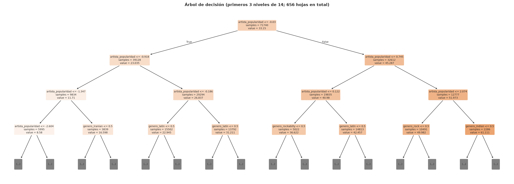
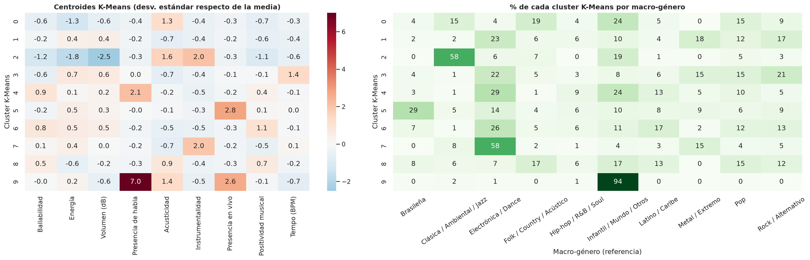
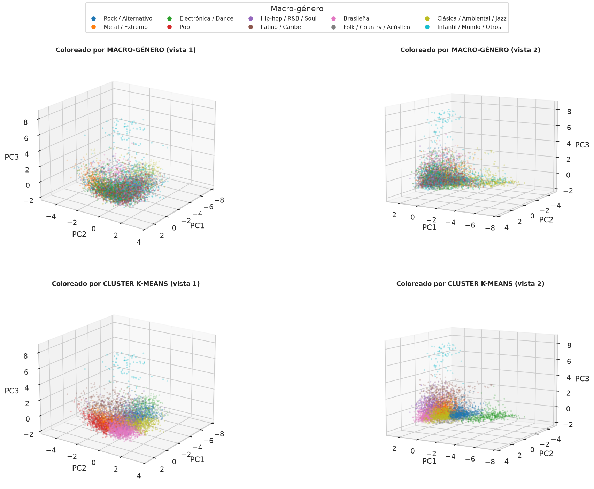
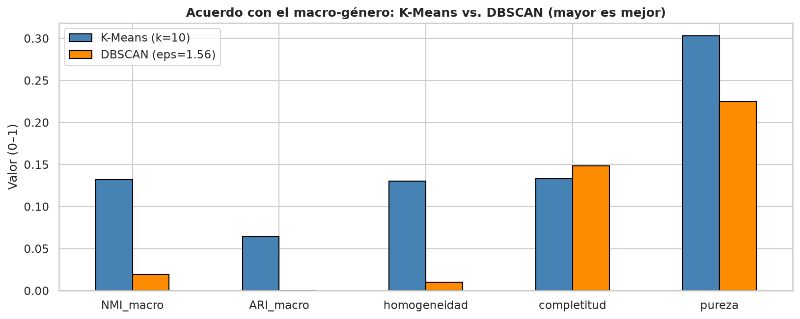
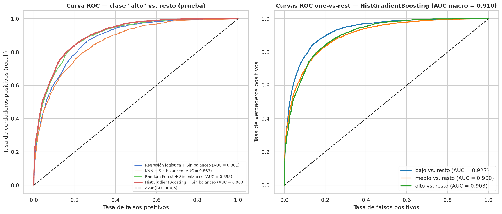

# 🎵 Inteligencia Musical y Predicción de Popularidad de Canciones

Proyecto desarrollado para la asignatura **Machine Learning (MLY1101)** de **Duoc UC**.

El proyecto analiza un conjunto de datos de canciones de Spotify para estudiar si los atributos medibles de una canción y el historial de su artista permiten anticipar su popularidad. También busca descubrir patrones útiles para la curaduría musical: perfiles sonoros, nichos y canciones atípicas.

| | |
|---|---|
| **Integrantes** | Alejandra González, Constanza González, Diego Villar |
| **Docente** | Marco Japke |
| **Caso** | C — Spotify Tracks |
| **Metodología** | CRISP-DM |
| **Entrega actual** | Evaluación Parcial N.º 2 (modelamiento y evaluación) |
| **Notebook principal** | [`notebooks/EP2_Spotify_CRISP_DM_Modelado.ipynb`](notebooks/EP2_Spotify_CRISP_DM_Modelado.ipynb) |
| **Notebook EP1 (histórico)** | [`notebooks/EP1_Spotify_CRISP_DM_COMPLETO.ipynb`](notebooks/EP1_Spotify_CRISP_DM_COMPLETO.ipynb) |

---

## Resumen ejecutivo

| Tarea | Mejor modelo | Resultado en prueba | Baseline |
|---|---|---|---|
| Regresión (popularidad 0–100) | HistGradientBoosting | **MAE 9,24 · RMSE 14,21 · R² 0,52** | MAE 17,17 · R² 0,00 |
| Clasificación (bajo / medio / alto) | HistGradientBoosting **sin balanceo** (elegido por ROC-AUC) | **ROC-AUC 0,91 · Accuracy 0,79 · F1 macro 0,71** · Recall "alto" 0,41 | AUC 0,50 · F1 macro 0,21 |
| No supervisado (objetivo común: recuperar el macro-género desde el audio) | **K-Means (k = 10)** gana a DBSCAN | NMI vs. macro-género 0,13 (DBSCAN 0,02) · pureza 30% | — |

**Hallazgos principales**

- **El artista es el predictor más importante, seguido por el género.** El audio por sí solo explica ~10% de la varianza de la popularidad. Con género se llega a ~38%, y con género + artista a ~52%.
- **El clasificador sirve para priorizar.** Entre el **1% de canciones con mayor probabilidad de "alto", el 93% es realmente popular** (8 veces la tasa base de 11%).
- **Con ROC-AUC como criterio, "sin balanceo" gana en los 4 clasificadores.** El balanceo cambia el umbral de decisión, no la capacidad de ordenar. Por eso el ganador tiene un AUC excelente, pero recall de "alto" bajo con el umbral por defecto (0,41 < 0,60).
- **Se cumplen 9 de 10 KPIs.** Falla el recall de "alto", que se puede corregir ajustando el umbral de decisión. Además, para artistas nuevos (28% de la prueba) el MAE es 11,3.
- **K-Means y DBSCAN** se compararon con el mismo objetivo (recuperar el macro-género desde el audio). **K-Means gana**, pero ninguno recupera bien los géneros. El PCA 3D confirma que el audio es un continuo sin "islas" por género.

---

# 1. Descripción del problema de negocio

Un equipo de inteligencia musical necesita saber si los **atributos medibles de una canción** (audio, género, contenido explícito) y el **historial de su artista** permiten anticipar su nivel de popularidad en Spotify. El objetivo es apoyar:

- la curaduría editorial y el armado de playlists;
- la priorización de lanzamientos para escucha y promoción;
- la organización del catálogo en segmentos y nichos manejables.

La popularidad es una variable de **0 a 100** calculada por Spotify. Se aborda de dos formas complementarias:

- como **regresión**: estimar el valor de popularidad;
- como **clasificación**: estimar el nivel bajo / medio / alto, que es más accionable.

# 2. Objetivos del proyecto

**Objetivo general.** Desarrollar, comparar y evaluar modelos de Machine Learning que estimen la popularidad de una canción, y descubrir mediante aprendizaje no supervisado patrones útiles para la curaduría.

**Objetivos específicos**

1. Asegurar una base de datos limpia, auditable y **sin fuga de información** (EP1, revisada en EP2).
2. Entrenar y comparar **4 modelos de regresión** contra un baseline.
3. Entrenar y comparar **4 modelos de clasificación**, evaluando **distintos métodos de balanceo**.
4. Agrupar las canciones por su sonido con **K-Means y DBSCAN** (mismo objetivo y misma evaluación) y comprobar cuál recupera mejor los **macro-géneros**.
5. Cuantificar sesgos del modelo (error por género) y traducir los resultados en recomendaciones.

# 3. KPIs

Todos los umbrales se fijaron **antes** de evaluar sobre el conjunto de prueba.

| KPI | Tipo | Umbral | Resultado | Cumple |
|---|---|---|---:|:---:|
| Cobertura de datos | Calidad | ≥ 99% | 99,86% | ✅ |
| Canciones (artista + título) compartidas train/test | Calidad | 0 | 0 | ✅ |
| MAE (HistGradientBoosting) | Regresión | < 10 | 9,24 | ✅ |
| RMSE (HistGradientBoosting) | Regresión | < 15 | 14,21 | ✅ |
| R² (HistGradientBoosting) | Regresión | > 0,20 | 0,521 | ✅ |
| **ROC-AUC macro (HistGradientBoosting)** | Clasificación | ≥ 0,80 | 0,910 | ✅ |
| Accuracy (HistGradientBoosting) | Clasificación | > 0,50 | 0,790 | ✅ |
| F1 macro (HistGradientBoosting) | Clasificación | > 0,45 | 0,713 | ✅ |
| Recall clase "alto" (HistGradientBoosting) | Clasificación | ≥ 0,60 | 0,409 | ❌ |
| Silueta K-Means (k = 10, prueba) | No supervisado | ≥ 0,15 | 0,164 | ✅ |

**Por qué falla el recall de "alto":** el ganador se elige por ROC-AUC (recomendación docente) y resulta ser un modelo **sin balanceo**, que aplica el umbral por defecto. Con el criterio anterior (F1 macro), Random Forest + ROS cumplía (0,61). La curva ROC muestra que existe un umbral con recall ≈ 0,60 y una tasa de falsos positivos de ~0,10–0,12. La solución recomendada es **calibrar el umbral de la clase "alto"** en validación cruzada.

En la versión sin artista no se cumplían el MAE (11,05), el RMSE (15,77) ni el recall de "alto" (0,51). Esos resultados se conservan en `data/processed/*_sin_artista.csv`.

**Matiz:** para canciones de artistas que no aparecen en entrenamiento, el MAE es 11,3, por encima del umbral. El cumplimiento global depende de que la mayoría de los lanzamientos sean de artistas con historial.

# 4. Fuente de datos

**Spotify Tracks Dataset — Kaggle** (`data/raw/Spotify_Tracks_Dataset.csv`)

- 114.000 filas, 20 columnas útiles, 89.741 IDs de canción, **114 géneros**.
- Una canción aparece una vez por cada género asociado.
- **Limitaciones:** el dataset no declara fecha de extracción ni versión de la API, y la popularidad cambia en el tiempo. Uso académico; no se distribuye audio.

| Variable | Tipo | Rol |
|---|---|---|
| `popularidad` | 0–100 | **Target** (regresión y, discretizada, clasificación) |
| `duracion_ms`, `bailabilidad`, `energia`, `volumen_db`, `presencia_habla`, `acusticidad`, `instrumentalidad`, `presencia_en_vivo`, `positividad`, `tempo_bpm` | Numéricas | Predictoras |
| `contenido_explicito`, `tonalidad`, `modo`, `compas` | Categóricas (códigos) | Predictoras (one-hot) |
| `genero_musical` | Categórica, 114 valores | Predictora (**multi-hot**: 114 columnas binarias) |
| `artistas` | Texto, 31.388 valores | Predictora (**target encoding**, ver 6.3) |
| `id_cancion`, `nombre_album`, `nombre_cancion` | Texto | Identificadores (no se usan como predictoras; el título solo agrupa reediciones) |

# 5. Metodología CRISP-DM

| Fase | Contenido | Estado |
|---|---|---|
| 1. Comprensión del negocio | Problema, objetivos, KPIs | ✅ (actualizada en EP2) |
| 2. Comprensión de los datos | Auditoría de calidad, distribuciones, correlaciones | ✅ EP1 |
| 3. Preparación de los datos | Limpieza, EDA, representación multi-hot, partición sin fuga, codificación del artista, targets | ✅ (corregida en EP2) |
| 4. Modelado | 4 regresiones, 4 clasificaciones + balanceo, K-Means, DBSCAN | ✅ EP2 |
| 5. Evaluación | Métricas en prueba, KPIs, importancia de variables, sesgo por género | ✅ EP2 |
| 6. Despliegue | Modelos serializados en `models/`, propuesta de uso y monitoreo | 🟡 Propuesta |

## 5.1 Revisión del EP1 y correcciones aplicadas

| # | Problema en EP1 | Corrección en EP2 |
|---|---|---|
| 1 | El README planteaba regresión y el notebook clasificación, con KPIs distintos. | Se abordan ambas tareas, con KPIs unificados. |
| 2 | Partición agrupada solo por `id_cancion`. **4.737 pares artista + título tienen varios IDs** (reediciones; 49% con audio idéntico). **1.894** de ellos habrían quedado a la vez en train y test (**fuga de información**). | La partición (`GroupShuffleSplit`) y la validación cruzada (`GroupKFold`) se agrupan por `clave_cancion` = artista + título normalizados. |
| 3 | El modelado usaba una fila por canción-género, lo que sobrerrepresenta a 16.299 canciones con varios géneros. | **1 canción = 1 fila**, con géneros codificados en *multi-hot*. |
| 4 | La tabla multi-género se construía con el compás ya imputado fuera del pipeline. | Se construye desde `df_base`, y la moda se aprende dentro del pipeline en cada pliegue. |
| 5 | Target de clasificación por **terciles** (cortes 23 y 43): con eso, una canción con popularidad 45 era "alta". | **Umbrales de negocio fijos**: bajo < 30, medio 30–59, alto ≥ 60. Al no aprenderse de los datos, no generan fuga. |
| 6 | Ruta del CSV relativa fija (fallaba fuera de `notebooks/`). | Búsqueda automática de la ruta. |
| 7 | Celdas vacías, desordenadas o con referencias erróneas. | Completadas y reordenadas. |

## 5.2 Decisiones de diseño del equipo (versiones 2 y 3)

| Decisión | Implementación |
|---|---|
| **Incluir el artista** en el pipeline, por su influencia en la popularidad | *Target encoding* suavizado con *cross-fitting*; en colaboraciones se usa el máximo entre artistas. Se compara siempre con el modelo sin artista. |
| **K-Means y DBSCAN** como modelos no supervisados (requisito de la asignatura) | DBSCAN reemplaza al clustering jerárquico de la versión anterior. |
| **Árbol de decisión en lugar de Ridge** (v3): los 4 regresores son no lineales | `DecisionTreeRegressor`. |
| **Mismo objetivo para K-Means y DBSCAN** (v3) | Ambos agrupan por audio y se evalúan contra 10 **macro-géneros**, con las mismas métricas y PCA 3D. |
| **ROC-AUC como métrica principal** de clasificación (v3, recomendación docente) | Selección del balanceo, de los hiperparámetros y del ganador por AUC; curvas ROC. |

Las **reglas de limpieza de la EP1 se mantienen**: 158 filas eliminadas (99,86% conservado), 20 álbumes imputados y la moda de compás. Su justificación está en el notebook (sección 3.1).

# 6. Preparación y análisis exploratorio (EDA)

## 6.1 Calidad y limpieza (EP1)

| Variable | Condición | Tratamiento |
|---|---|---|
| `artistas`, `nombre_cancion` | Nulo, vacío o `?` | Eliminar fila |
| `nombre_album` | Nulo, vacío o `?` | Imputar `DESCONOCIDO` |
| `tempo_bpm`, `bailabilidad`, `energia` | Igual a 0 | Eliminar fila (decisión metodológica; afecta sobre todo a `sleep`) |
| `compas` | 0 o nulo | Moda aprendida **solo en entrenamiento** (dentro del pipeline) |
| `duracion_ms` | ≤ 0 o nula | Eliminar fila |
| Outliers (IQR) | — | Se detectan pero **no se eliminan**: son valores musicales válidos |


## 6.2 Hallazgos del EDA

- **Ninguna variable de audio tiene correlación lineal fuerte con la popularidad** (|r| < 0,10). La más alta en valor absoluto es instrumentalidad (−0,096).
- Entre predictoras hay multicolinealidad: energía ↔ volumen ≈ +0,76 y energía ↔ acusticidad ≈ −0,74. Se maneja con regularización en los modelos lineales.
- **La popularidad media varía mucho entre géneros** (pop-film y k-pop arriba; iranian y romance abajo).
- **10,6% de las canciones tiene popularidad 0.** Muchas son reediciones de una canción que sí es popular con otro ID; es ruido propio de la fuente.

| | |
|---|---|
|  |  |

## 6.3 Base de modelamiento (EP2)

- **89.583 canciones** (1 fila por ID), con 10 numéricas, 4 categóricas, 114 columnas de género y el artista.
- Partición **80/20 agrupada por artista + título**: 71.740 canciones en entrenamiento y 17.843 en prueba, con 0 claves y 0 IDs compartidos.
- **Pipeline** (`ColumnTransformer`, ajustado solo con los pliegues de entrenamiento):
  - numéricas → `StandardScaler`;
  - categóricas → `SimpleImputer(most_frequent)` + `OneHotEncoder`;
  - géneros → `passthrough`;
  - **artista** → `CodificadorArtista` + `StandardScaler`.

  Resultado: 145 columnas.

### Codificación del artista

El artista tiene **31.388 valores** y el 64% aparece con una sola canción, así que un one-hot no es viable. El equipo evaluó cuatro opciones (target encoding, frecuencia, one-hot de los artistas frecuentes y la combinación) y eligió **target encoding** (`src/transformadores.py`):

- **Valor del artista:** `(suma de popularidad + 10 · media global) / (n.º de canciones + 10)`. El suavizado acerca a la media global a los artistas con pocas canciones.
- **Colaboraciones (25% de las canciones):** se toma el **máximo** entre los artistas.
- **Artista nuevo:** recibe la media global.
- **Sin fuga:** al ajustar se usa *cross-fitting* (5 pliegues agrupados por artista + título), así que una canción nunca codifica su propia popularidad. El codificador vive dentro del pipeline, por lo que se reajusta en cada pliegue de la validación cruzada.
- **Clasificación:** se codifica el nivel ordinal medio del artista (bajo = 0, medio = 1, alto = 2).

**Targets:**
- **Regresión:** `popularidad`.
- **Clasificación:** `bajo` (0–29) 45%, `medio` (30–59) 44%, `alto` (≥ 60) **11%**. Es un problema desbalanceado.


# 7. Modelado

**Validación:** `GroupKFold` de 3 pliegues por artista + título, solo con los datos de entrenamiento. Los hiperparámetros se ajustan con `RandomizedSearchCV`. El preprocesamiento y el balanceo van dentro del pipeline, y el conjunto de prueba se usa **una sola vez**.

## 7.1 Regresión: 4 modelos (todos no lineales)

| Modelo | Cómo funciona / por qué se incluye | Mejores hiperparámetros | MAE CV | R² CV |
|---|---|---|---:|---:|
| Baseline (media) | Referencia mínima | — | 17,27 | 0,00 |
| **Árbol de decisión** | Preguntas sucesivas ("¿popularidad del artista > x?", "¿género = pop?"); predice la media de cada hoja. Muy interpretable; tiene alta varianza. | `max_depth=14`, `min_samples_leaf=10` | 10,42 | 0,418 |
| **KNN** | Promedia la popularidad de las 10 canciones más parecidas | `k=10`, `weights=distance` | 11,08 | 0,397 |
| **Random Forest** | *Bagging*: promedia 150 árboles entrenados con muestras distintas | `max_features=0.33`, `min_samples_leaf=5` | 9,68 | 0,497 |
| **HistGradientBoosting** | *Boosting*: árboles en secuencia que corrigen errores | `lr=0.03`, `max_iter=600`, `max_leaf_nodes=63` | **9,42** | **0,502** |

Random Forest reduce el error del árbol individual en ~7%, y el boosting lo reduce aún más. Los primeros cortes del árbol usan la popularidad del artista y el género.

| | |
|---|---|
|  |  |

**Aporte del artista** (HistGradientBoosting, CV):

| Variables | MAE | R² |
|---|---:|---:|
| Solo audio + categóricas | 15,63 | 0,105 |
| + género | 11,59 | 0,383 |
| + artista (sin género) | 10,81 | 0,421 |
| **+ género + artista** | **9,69** | **0,497** |

## 7.2 Clasificación: 4 modelos × 5 técnicas de balanceo

**Métrica principal: ROC-AUC macro (one-vs-rest)**, por recomendación docente:
- mide la capacidad de **ordenar** las canciones por probabilidad;
- no depende del umbral de decisión ni del desbalance de clases.

Desempate y métricas complementarias: F1 macro y recall de "alto".

**Todas las pruebas de balanceo (CV, GroupKFold 3).** El remuestreo se aplica solo en los pliegues de entrenamiento:

| Modelo | Técnica | ROC-AUC | F1 macro | Recall "alto" | Accuracy |
|---|---|---:|---:|---:|---:|
| Regresión logística | **Sin balanceo ✅** | **0,891** | 0,672 | 0,319 | 0,768 |
| Regresión logística | class_weight | 0,884 | 0,662 | 0,757 | 0,708 |
| Regresión logística | RUS | 0,882 | 0,663 | 0,757 | 0,709 |
| Regresión logística | ROS | 0,884 | 0,661 | 0,758 | 0,708 |
| Regresión logística | SMOTE | 0,884 | 0,664 | 0,744 | 0,711 |
| KNN | **Sin balanceo ✅** | **0,859** | 0,630 | 0,250 | 0,734 |
| KNN | RUS | 0,842 | 0,624 | 0,687 | 0,669 |
| KNN | ROS | 0,845 | 0,625 | 0,683 | 0,673 |
| KNN | SMOTE | 0,840 | 0,586 | 0,800 | 0,621 |
| Random Forest | **Sin balanceo ✅** | **0,906** | 0,697 | 0,358 | 0,785 |
| Random Forest | class_weight | 0,903 | 0,713 | 0,683 | 0,762 |
| Random Forest | RUS | 0,893 | 0,689 | 0,755 | 0,734 |
| Random Forest | ROS | 0,904 | 0,719 | 0,623 | 0,772 |
| Random Forest | SMOTE | 0,903 | 0,715 | 0,631 | 0,768 |
| HistGradientBoosting | **Sin balanceo ✅** | **0,909** | 0,710 | 0,419 | 0,786 |
| HistGradientBoosting | class_weight | 0,905 | 0,704 | 0,735 | 0,752 |
| HistGradientBoosting | RUS | 0,896 | 0,690 | 0,758 | 0,736 |
| HistGradientBoosting | ROS | 0,905 | 0,704 | 0,722 | 0,753 |
| HistGradientBoosting | SMOTE | 0,907 | 0,716 | 0,563 | 0,775 |

✅ = mejor técnica para ese modelo (mayor AUC). `class_weight` no aplica a KNN.

**Lectura:**
- En los 4 modelos, **"sin balanceo" tiene el mayor AUC**. El balanceo mueve el umbral de decisión, pero no mejora la capacidad de ordenar.
- **RUS** pierde datos y **ROS/SMOTE** distorsionan las probabilidades.
- Lo que el balanceo sí logra es subir el recall de "alto" de ~0,3–0,4 a ~0,7–0,8, a costa de precisión.
- `class_weight` es el mejor compromiso en promedio: AUC 0,897 y F1 0,693.


**Ajuste de hiperparámetros** (con la mejor técnica de cada modelo, maximizando AUC):

| Modelo | Técnica | Mejores hiperparámetros | ROC-AUC CV | F1 macro CV | Recall "alto" CV |
|---|---|---|---:|---:|---:|
| Baseline | — | — | 0,500 | 0,208 | 0,000 |
| Regresión logística | Sin balanceo | `C=10` | 0,891 | 0,673 | 0,319 |
| KNN | Sin balanceo | `k=60`, `weights=distance` | 0,865 | 0,618 | 0,210 |
| Random Forest | Sin balanceo | `max_features=sqrt`, `min_samples_leaf=3` | 0,906 | 0,697 | 0,358 |
| **HistGradientBoosting** | **Sin balanceo** | `lr=0.03`, `max_iter=300`, `max_leaf_nodes=63` | **0,909** | **0,710** | **0,423** |

> **🏆 Modelo ganador: HistGradientBoosting + sin balanceo** (ROC-AUC CV 0,909).

## 7.3 No supervisado — objetivo común de K-Means y DBSCAN

**Objetivo común:** agrupar las canciones usando **solo cómo suenan** y comprobar si esos grupos recuperan las **familias musicales (macro-géneros)**. Las condiciones son las mismas para los dos algoritmos:
- **Variables:** las 9 de audio, estandarizadas.
- **Muestra:** las mismas 20.000 canciones de entrenamiento, más 5.000 de prueba para comprobar la generalización.
- **Métricas:** NMI, ARI, homogeneidad, completitud, pureza, silueta y Davies-Bouldin.
- **Criterio del ganador:** mayor NMI frente al macro-género.

**Referencia — 10 macro-géneros** (asignación manual de los 114 géneros; `data/processed/macrogeneros.csv`): Rock/Alternativo, Metal/Extremo, Electrónica/Dance, Pop, Hip-hop/R&B/Soul, Latino/Caribe, Brasileña, Folk/Country/Acústico, Clásica/Ambiental/Jazz e Infantil/Mundo/Otros.

### K-Means: cómo agrupa

K-Means minimiza la distancia de cada canción al **centroide** de su grupo:
1. Elige k centroides iniciales (`k-means++`).
2. Asigna cada canción al centroide más cercano.
3. Recalcula cada centroide como el promedio de su grupo.
4. Repite los pasos 2 y 3 hasta que no hay cambios.

Se ejecuta 10 veces y se queda con la mejor solución. Toda canción queda en un grupo. **k = 10**, igual al número de macro-géneros (el codo y la silueta se muestran como referencia).

| Cluster | Perfil sonoro | Macro-género dominante | % "alto" |
|---|---|---|---:|
| 0 | Acústicas melancólicas | Infantil/Mundo (24%), Folk (19%) | 10,2% |
| 1 | Intensas y oscuras | Electrónica (23%), Metal (18%), Rock (17%) | **15,7%** |
| 2 | Ambientales / clásicas | **Clásica/Ambiental (58%)** | 6,8% |
| 3 | Rápidas e intensas | Electrónica (22%), Rock (21%) | 11,9% |
| 4 | Rítmicas con voz hablada | Electrónica (29%), Mundo (24%) | 12,1% |
| 5 | En vivo | **Brasileña (29%)** | 6,2% |
| 6 | Bailables y alegres | Electrónica (26%), Latino (17%) | 14,8% |
| 7 | Electrónica instrumental | **Electrónica (58%)** | 3,4% |
| 8 | Acústicas alegres | Folk (17%), Mundo (17%), Pop (15%) | 10,1% |
| 9 | Habladas (comedia) | **Infantil/Mundo/Otros (94%)** | 0,5% |



**PCA 3D:** las 3 primeras componentes explican el **62%** de la varianza:
- **PC1 = intensidad** (energía y volumen frente a acusticidad);
- **PC2 = baile y ánimo** (bailabilidad y positividad);
- **PC3 = voz hablada / en vivo**.

Coloreada por macro-género, la nube está **mezclada**: no hay "islas" por género, salvo la zona del contenido hablado y la cola de la música clásica/ambiental. K-Means corta esa nube continua en regiones.



## 7.4 DBSCAN y comparación con K-Means

**DBSCAN agrupa por densidad.** Una canción con al menos `min_samples` = 18 vecinas a menos de `eps` es un "núcleo". Los núcleos cercanos forman un cluster, y las canciones aisladas quedan como **ruido**. `eps` = 1,56 se toma del codo de la curva de k-distancias.

**Resultado:** 2 clusters (catálogo principal 97% y nicho de comedia 0,7%) + 2,3% de canciones atípicas.
- Ningún `eps` probado (0,6–2,0) supera un NMI de 0,06.
- Con `eps` bajo, entre el 47% y el 88% de las canciones queda como ruido.

| Métrica (misma muestra) | K-Means (k = 10) | DBSCAN (eps = 1,56) |
|---|---:|---:|
| **NMI vs. macro-género** (criterio) | **0,132** | 0,019 |
| ARI vs. macro-género | **0,064** | 0,000 |
| Homogeneidad | **0,131** | 0,010 |
| Completitud | 0,133 | 0,148 |
| Pureza | **0,303** | 0,225 |
| NMI en prueba | **0,135** | 0,023 |
| Silueta | 0,170 | 0,571* |
| Grupos / % ruido | 10 / 0% | 2 / 2,3% |

\*La silueta de DBSCAN engaña: el 99% de las canciones cae en un solo grupo.

> **🏆 Ganador: K-Means.** Recupera ~7 veces más información del macro-género que DBSCAN. Ninguno recupera bien los géneros, porque el audio es un continuo y gran parte de la identidad de género es cultural. DBSCAN queda como herramienta complementaria para detectar canciones atípicas.

| | |
|---|---|
|  |  |

# 8. Evaluación (conjunto de prueba)

## 8.1 Regresión

| Modelo | MAE | RMSE | R² | Mejora MAE vs baseline |
|---|---:|---:|---:|---:|
| Baseline | 17,17 | 20,53 | 0,000 | — |
| Árbol de decisión | 10,20 | 15,31 | 0,444 | 40,6% |
| KNN | 10,73 | 15,72 | 0,413 | 37,5% |
| Random Forest | 9,49 | 14,41 | 0,507 | 44,7% |
| **HistGradientBoosting** | **9,24** | **14,21** | **0,521** | **46,2%** |

Las métricas de prueba coinciden con las de CV, así que no hay sobreajuste ni fuga. El modelo todavía se contrae hacia la media:
- las canciones con popularidad 0 se sobreestiman en ~20 puntos;
- los éxitos (61–80) se subestiman en ~18 puntos.


## 8.2 Clasificación

| Modelo (sin balanceo) | ROC-AUC macro | AUC "alto" vs. resto | Accuracy | F1 macro | Recall "alto" | Precisión "alto" |
|---|---:|---:|---:|---:|---:|---:|
| Baseline | 0,500 | — | 0,449 | 0,206 | 0,000 | 0,000 |
| Regresión logística | 0,889 | 0,881 | 0,767 | 0,670 | 0,303 | 0,641 |
| KNN | 0,869 | 0,863 | 0,740 | 0,629 | 0,225 | 0,699 |
| Random Forest | 0,906 | 0,898 | 0,786 | 0,701 | 0,370 | 0,647 |
| **HistGradientBoosting** | **0,910** | **0,903** | **0,790** | **0,713** | **0,409** | 0,648 |

**Curvas ROC one-vs-rest del ganador:**
- "bajo": AUC 0,927, la clase más fácil;
- "alto": AUC 0,903;
- "medio": AUC 0,900, la más difícil.

**Con el umbral por defecto el modelo es conservador:** cuando predice "alto" acierta el 65% de las veces, pero detecta solo el 41% de los éxitos.

**Lista corta:** el **top 1% por probabilidad de "alto" tiene 93% de aciertos**, el top 5% un 71% y el top 10% un 58% (tasa base: 11%).

| | |
|---|---|
|  |  |

## 8.3 Importancia de variables, sesgo y artistas nuevos

- **Importancia por permutación** (aumento del MAE al desordenar cada variable):
  - **artista**: +7,5 de MAE;
  - **género**: +3,0;
  - variables de audio: ≤ 0,16 cada una, sin aportar casi nada por separado.
- **Sesgo por género:**
  - el MAE va de 2,5 (iranian, comedy) a 28,9 (dance);
  - el error no depende de la popularidad media del género (r = 0,06), sino de su heterogeneidad;
  - el género `sleep`, el más afectado por la limpieza, tiene un MAE de 8,2, sin perjuicio observable.
- **Artista conocido vs. nuevo:**

| Grupo | Canciones | MAE con artista | MAE sin artista | R² con artista | R² sin artista |
|---|---:|---:|---:|---:|---:|
| Artista conocido | 12.888 (72%) | **8,43** | 10,62 | **0,57** | 0,44 |
| Artista nuevo | 4.955 (28%) | 11,34 | 12,17 | 0,38 | 0,33 |

La ganancia del artista se concentra en artistas con historial. Esto genera un riesgo de **efecto Mateo**: el modelo favorece a quien ya es popular.

| | |
|---|---|
|  |  |

## 8.4 Recomendaciones para el negocio

1. **Usar el clasificador para rankear** lanzamientos: revisar primero el top 1–5% por probabilidad de "alto". **Siempre con revisión humana.** Si se necesita etiquetar "alto" con recall ≥ 0,60, **bajar el umbral de decisión** (calibrado en CV) o usar `class_weight`.
2. **Para artistas nuevos**, consultar también el modelo sin artista, de modo que no se penalice a quien no tiene historial.
3. **Usar el regresor** para estimar el nivel general de una canción, no para identificar éxitos puntuales.
4. **Usar los 10 perfiles K-Means** para playlists por contexto (fiesta, foco, relajación) y las **atípicas de DBSCAN** para revisión de metadatos. No usar el audio para reetiquetar géneros: el acuerdo es bajo.
5. **Para mejorar los modelos:**
   - incorporar la fecha de lanzamiento y la exposición en playlists;
   - deduplicar las reediciones en la fuente.

# 9. Despliegue (propuesta)

`models/` contiene pipelines completos (preprocesamiento + modelo) serializados con `joblib`:

| Archivo | Contenido |
|---|---|
| `regresor_popularidad.joblib` | HistGradientBoosting (regresión) |
| `clasificador_popularidad.joblib` | HistGradientBoosting sin balanceo (clasificación) |
| `kmeans_perfiles_sonoros.joblib` | `StandardScaler` + K-Means (k = 10) |

Los pipelines usan el transformador propio `src/transformadores.py`. Por eso hay que cargarlos desde la raíz del repositorio, o con `src/` en el `PYTHONPATH`:

```python
import joblib
modelo = joblib.load('models/clasificador_popularidad.joblib')
modelo.predict_proba(X_nuevo)  # mismas columnas que X, incluidas artistas y nombre_cancion (sección 3.13)
```

**Plan de monitoreo:**

- Recalcular MAE, F1 macro, recall de "alto" y error por género cada mes, con canciones cuya popularidad ya se observó.
- Vigilar la deriva de las variables de entrada.
- Reentrenar si el F1 macro cae más de 0,05 o aparecen géneros nuevos.

# 10. Ética, sesgos y privacidad

- **Efecto Mateo:** el artista es el predictor más fuerte, así que el modelo favorece a artistas ya populares. Para artistas nuevos se recomienda usar también el modelo sin artista.
- **Ciclo de retroalimentación:** lo que se promociona se vuelve popular. Por eso el modelo debe usarse **solo como apoyo**, con supervisión humana.
- **Popularidad ≠ calidad artística.** El modelo no mide el mérito de un artista.
- **Sesgo de limpieza:** el 88% de las filas eliminadas por ceros de audio son del género `sleep`. Se evaluó su efecto en el desempeño y no se observa perjuicio.
- **Error desigual por género:** se reporta en la sección 8.3 y debe monitorearse.
- **Privacidad:** el dataset no contiene datos personales de usuarios, así que el riesgo es bajo. Si se incorporaran historiales de escucha, aplicarían minimización de datos y la normativa de protección de datos.

# 11. Estructura del proyecto

```text
machine-learning-spotify/
├── data/
│   ├── raw/Spotify_Tracks_Dataset.csv
│   └── processed/
│       ├── spotify_clean.csv, spotify_base_modelo.csv     # limpieza (EP1)
│       ├── spotify_multigenero.csv, particion_modelo.csv  # base de modelamiento EP2
│       ├── auditoria_faltantes.csv, balance_limpieza.csv, filas_descartadas.csv, ...
│       ├── resultados_cv_regresion.csv, resultados_test_regresion.csv
│       ├── resultados_balanceo.csv, resultados_cv_clasificacion.csv, resultados_test_clasificacion.csv
│       ├── ablacion_artista.csv, desempeno_artista_conocido_nuevo.csv
│       ├── balanceo_por_modelo_explicito.csv              # 19 pruebas de balanceo
│       ├── macrogeneros.csv, kmeans_perfiles.csv
│       ├── dbscan_sensibilidad_eps.csv, comparacion_kmeans_dbscan.csv
│       ├── importancia_permutacion.csv, errores_por_genero.csv, kpis_ep2.csv
│       └── *_sin_artista.csv                              # resultados de la versión sin artista
├── images/          # 00–05 EDA (EP1) · 06–17 modelamiento y evaluación (EP2)
├── models/          # pipelines serializados (joblib)
├── notebooks/
│   ├── EP1_Spotify_CRISP_DM_COMPLETO.ipynb    # entrega EP1 (histórico)
│   └── EP2_Spotify_CRISP_DM_Modelado.ipynb    # notebook completo y ejecutable (Fases 1–6)
├── src/transformadores.py   # CodificadorArtista (target encoding del artista)
├── requirements.txt
└── README.md
```

# 12. Ejecución

```bash
git clone https://github.com/ritnight/machine-learning-spotify
cd machine-learning-spotify
pip install -r requirements.txt
jupyter notebook notebooks/EP2_Spotify_CRISP_DM_Modelado.ipynb
```

Ejecutar con **Restart Kernel and Run All**. La ejecución completa toma ~40 minutos en 4 núcleos, sobre todo por la validación cruzada. En Google Colab hay que subir el CSV y la carpeta `src/`, y configurar `RUTA_DATOS` en la sección 2.1.

> El notebook EP2 regenera `spotify_multigenero.csv` y `particion_modelo.csv` con la nueva partición por artista + título. Si se vuelve a ejecutar el notebook EP1, esos dos archivos vuelven a su versión anterior.

---

**Duoc UC — 2026 · Machine Learning (MLY1101) · Evaluación Parcial N.º 2 · Caso C**
