# 🎵 Inteligencia Musical y Predicción de Popularidad de Canciones

Proyecto desarrollado para la asignatura **Machine Learning (MLY1101)** de **Duoc UC**.

El proyecto analiza un conjunto de datos de canciones de Spotify para estudiar si sus atributos medibles permiten anticipar su popularidad. También busca descubrir patrones (perfiles sonoros y familias de géneros) útiles para la curaduría musical.

| | |
|---|---|
| **Integrantes** | Alejandra González, Constanza González, Diego Villar |
| **Docente** | Marco Japke |
| **Caso** | C — Spotify Tracks |
| **Metodología** | CRISP-DM |
| **Entrega actual** | Evaluación Parcial N.º 2 (modelamiento y evaluación) |
| **Notebook principal** | [`notebooks/EP2_Spotify_CRISP_DM_Modelado.ipynb`](notebooks/EP2_Spotify_CRISP_DM_Modelado.ipynb) |
| **Notebook EP1 (histórico)** | [`notebooks/EP1_Spotify_CRISP_DM_COMPLETO.ipynb`](notebooks/EP1_Spotify_CRISP_DM_COMPLETO.ipynb) |

---

## Resumen ejecutivo

| Tarea | Mejor modelo | Resultado en prueba | Baseline |
|---|---|---|---|
| Regresión (popularidad 0–100) | HistGradientBoosting | **MAE 11,05 · RMSE 15,77 · R² 0,41** | MAE 17,17 · R² 0,00 |
| Clasificación (bajo / medio / alto) | Random Forest + sobremuestreo (ROS) | **Accuracy 0,74 · F1 macro 0,68 · AUC 0,88** | F1 macro 0,21 |
| No supervisado 1 | K-Means (k = 7 perfiles sonoros) | Silueta 0,19 (prueba), estabilidad ARI 0,996 | — |
| No supervisado 2 | Jerárquico Ward (11 familias de géneros) | Silueta 0,27 | — |

**Hallazgos principales**

- **Lo que más pesa es el género.** El audio por sí solo explica ~10% de la varianza de la popularidad; con el género se llega a ~40%. Gran parte de esa señal es **cultural** (idioma, mercado, escena), no acústica.
- **El clasificador sirve para priorizar.** Entre el **1% de canciones con mayor probabilidad de "alto", el 89% es realmente popular** (8 veces la tasa base de 11%).
- **Comparación de balanceo:** sin balancear, los modelos ignoran la clase "alto" (recall < 0,3). El sobremuestreo maximiza el F1 macro; `class_weight` maximiza el recall de "alto".
- Los perfiles **"bailables y alegres"** e **"intensos"** concentran la mayor proporción de éxitos. Los perfiles instrumentales, ambientales y hablados tienen la menor.

---

# 1. Descripción del problema de negocio

Un equipo de inteligencia musical necesita saber si los **atributos medibles de una canción** (audio, género, contenido explícito) permiten anticipar su nivel de popularidad en Spotify. El objetivo es apoyar:

- la curaduría editorial y el armado de playlists;
- la priorización de lanzamientos para escucha y promoción;
- la organización del catálogo en segmentos y familias manejables.

La popularidad es una variable de **0 a 100** calculada por Spotify. Se aborda de dos formas complementarias:

- como **regresión**: estimar el valor de popularidad;
- como **clasificación**: estimar el nivel bajo / medio / alto, que es más accionable.

# 2. Objetivos del proyecto

**Objetivo general.** Desarrollar, comparar y evaluar modelos de Machine Learning que estimen la popularidad de una canción, y descubrir mediante aprendizaje no supervisado patrones útiles para la curaduría.

**Objetivos específicos**

1. Asegurar una base de datos limpia, auditable y **sin fuga de información** (EP1, revisada en EP2).
2. Entrenar y comparar **4 modelos de regresión** contra un baseline.
3. Entrenar y comparar **4 modelos de clasificación**, evaluando **distintos métodos de balanceo**.
4. Segmentar el catálogo en **perfiles sonoros** (K-Means).
5. Agrupar los 114 géneros en **familias** (clustering jerárquico).
6. Cuantificar sesgos del modelo (error por género) y traducir los resultados en recomendaciones.

# 3. KPIs

Todos los umbrales se fijaron **antes** de evaluar sobre el conjunto de prueba.

| KPI | Tipo | Umbral | Resultado | Cumple |
|---|---|---|---:|:---:|
| Cobertura de datos | Calidad | ≥ 99% | 99,86% | ✅ |
| Canciones (artista + título) compartidas train/test | Calidad | 0 | 0 | ✅ |
| MAE (HistGradientBoosting) | Regresión | < 10 | 11,05 | ❌ |
| RMSE (HistGradientBoosting) | Regresión | < 15 | 15,77 | ❌ |
| R² (HistGradientBoosting) | Regresión | > 0,20 | 0,410 | ✅ |
| Accuracy (Random Forest) | Clasificación | > 0,50 | 0,738 | ✅ |
| F1 macro (Random Forest) | Clasificación | > 0,45 | 0,678 | ✅ |
| Recall clase "alto" (Random Forest) | Clasificación | ≥ 0,60 | 0,505 | ❌ |
| Silueta K-Means (prueba) | No supervisado | ≥ 0,15 | 0,192 | ✅ |

**KPIs no cumplidos.**

- **MAE y RMSE:** el error se concentra en los extremos. Las canciones con popularidad 0 suelen ser reediciones con otro ID, y los grandes éxitos dependen de información ausente en los datos (artista, marketing, playlists).
- **Recall de "alto":** la regresión logística + SMOTE sí lo cumple (0,71), a cambio de menor precisión (0,32). Con Random Forest también se puede reducir el umbral de decisión. Ver la sección 8.

# 4. Fuente de datos

**Spotify Tracks Dataset — Kaggle** (`data/raw/Spotify_Tracks_Dataset.csv`)

- 114.000 filas, 20 columnas útiles, 89.741 IDs de canción, **114 géneros**.
- Una canción aparece una vez por cada género asociado.
- **Limitaciones:** el dataset no declara fecha de extracción ni versión de la API, y la popularidad cambia en el tiempo. Uso académico; no se distribuye audio.

| Variable | Tipo | Rol |
|---|---|---|
| `popularidad` | 0–100 | **Target** (regresión y, discretizada, clasificación) |
| `duracion_ms`, `bailabilidad`, `energia`, `volumen_db`, `presencia_habla`, `acusticidad`, `instrumentalidad`, `presencia_en_vivo`, `positividad`, `tempo_bpm` | Numéricas | Predictoras |
| `contenido_explicito`, `tonalidad`, `modo`, `compas` | Categóricas (códigos) | Predictoras (one-hot) |
| `genero_musical` | Categórica, 114 valores | Predictora (**multi-hot**: 114 columnas binarias) |
| `id_cancion`, `artistas`, `nombre_album`, `nombre_cancion` | Texto | Identificadores (no se usan como predictoras) |

# 5. Metodología CRISP-DM

| Fase | Contenido | Estado |
|---|---|---|
| 1. Comprensión del negocio | Problema, objetivos, KPIs | ✅ (actualizada en EP2) |
| 2. Comprensión de los datos | Auditoría de calidad, distribuciones, correlaciones | ✅ EP1 |
| 3. Preparación de los datos | Limpieza, EDA, representación multi-hot, partición sin fuga, targets | ✅ (corregida en EP2) |
| 4. Modelado | 4 regresiones, 4 clasificaciones + balanceo, K-Means, jerárquico | ✅ EP2 |
| 5. Evaluación | Métricas en prueba, KPIs, importancia de variables, sesgo por género | ✅ EP2 |
| 6. Despliegue | Modelos serializados en `models/`, propuesta de uso y monitoreo | 🟡 Propuesta |

## 5.1 Revisión del EP1 y correcciones aplicadas

| # | Problema en EP1 | Corrección en EP2 |
|---|---|---|
| 1 | El README planteaba regresión y el notebook clasificación, con KPIs distintos. | Se abordan ambas tareas, con KPIs unificados. |
| 2 | Partición agrupada solo por `id_cancion`. **4.737 pares artista + título tienen varios IDs** (reediciones; 49% con audio idéntico). **1.894** de ellos habrían quedado a la vez en train y test (**fuga de información**). | La partición (`GroupShuffleSplit`) y la validación cruzada (`GroupKFold`) se agrupan por `clave_cancion` = artista + título normalizados. |
| 3 | El modelado usaba una fila por canción-género, lo que sobrerrepresenta a 16.299 canciones con varios géneros. | **1 canción = 1 fila**, con géneros codificados en *multi-hot*. |
| 4 | La tabla multi-género se construía con el compás ya imputado fuera del pipeline. | Se construye desde `df_base`, y la moda se aprende dentro del pipeline en cada pliegue. |
| 5 | Target de clasificación por **terciles** (cortes 23 y 43): con eso, una canción con popularidad 45 era "alta". | **Umbrales de negocio fijos**: bajo < 30, medio 30–59, alto ≥ 60. Al no aprenderse de los datos, no generan fuga. |
| 6 | Ruta del CSV relativa fija (fallaba fuera de `notebooks/`). | Búsqueda automática de la ruta. |
| 7 | Celdas vacías, desordenadas o con referencias erróneas. | Completadas y reordenadas. |

Las **reglas de limpieza de la EP1 se mantienen**: 158 filas eliminadas (99,86% conservado), 20 álbumes imputados y la moda de compás. Su justificación está en el notebook (sección 3.1).

# 6. Preparación y análisis exploratorio (EDA)

## 6.1 Calidad y limpieza (EP1)

| Variable | Condición | Tratamiento |
|---|---|---|
| `artistas`, `nombre_cancion` | Nulo, vacío o `?` | Eliminar fila |
| `nombre_album` | Nulo, vacío o `?` | Imputar `DESCONOCIDO` |
| `tempo_bpm`, `bailabilidad`, `energia` | Igual a 0 | Eliminar fila (decisión metodológica; afecta sobre todo a `sleep`) |
| `compas` | 0 o nulo | Moda aprendida **solo en entrenamiento** (dentro del pipeline) |
| `duracion_ms` | ≤ 0 o nula | Eliminar fila |
| Outliers (IQR) | — | Se detectan pero **no se eliminan**: son valores musicales válidos |

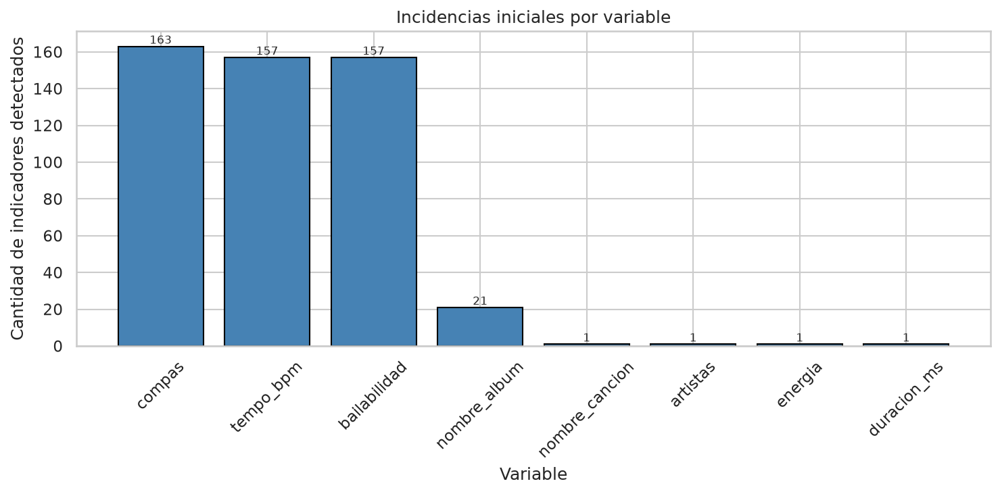

## 6.2 Hallazgos del EDA

- **Ninguna variable de audio tiene correlación lineal fuerte con la popularidad** (|r| < 0,10). La más alta en valor absoluto es instrumentalidad (−0,096).
- Entre predictoras hay multicolinealidad: energía ↔ volumen ≈ +0,76 y energía ↔ acusticidad ≈ −0,74. Se maneja con regularización en los modelos lineales.
- **La popularidad media varía mucho entre géneros** (pop-film y k-pop arriba; iranian y romance abajo).
- **10,6% de las canciones tiene popularidad 0.** Muchas son reediciones de una canción que sí es popular con otro ID; es ruido propio de la fuente.

| | |
|---|---|
| 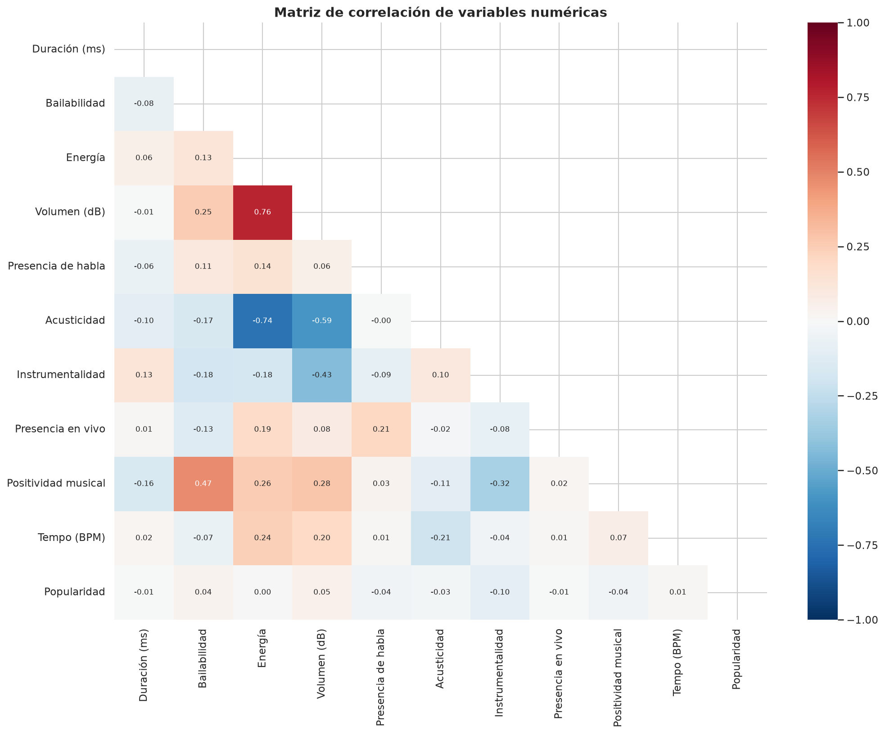 | 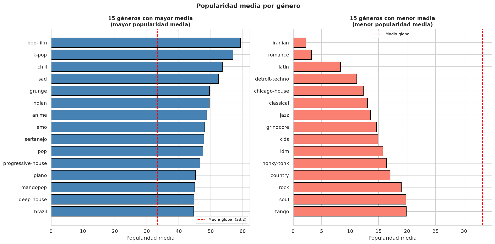 |

## 6.3 Base de modelamiento (EP2)

- **89.583 canciones** (1 fila por ID), con 10 numéricas, 4 categóricas y 114 columnas de género.
- Partición **80/20 agrupada por artista + título**: 71.740 canciones en entrenamiento y 17.843 en prueba, con 0 claves y 0 IDs compartidos.
- **Pipeline** (`ColumnTransformer`, ajustado solo con los pliegues de entrenamiento):
  - numéricas → `StandardScaler`;
  - categóricas → `SimpleImputer(most_frequent)` + `OneHotEncoder`;
  - géneros → `passthrough`.

  Resultado: 144 columnas.
- **Targets:**
  - **Regresión:** `popularidad`.
  - **Clasificación:** `bajo` (0–29) 45%, `medio` (30–59) 44%, `alto` (≥ 60) **11%**. Es un problema desbalanceado.

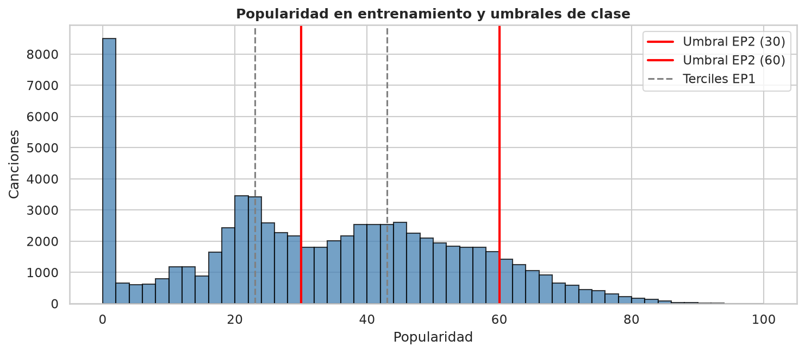

# 7. Modelado

**Validación:** `GroupKFold` de 3 pliegues por artista + título, solo con los datos de entrenamiento. Los hiperparámetros se ajustan con `RandomizedSearchCV`. El preprocesamiento y el balanceo van dentro del pipeline, y el conjunto de prueba se usa **una sola vez**.

## 7.1 Regresión: 4 modelos

| Modelo | Por qué se incluye | Mejores hiperparámetros | MAE CV | R² CV |
|---|---|---|---:|---:|
| Baseline (media) | Referencia mínima | — | 17,27 | 0,00 |
| **Ridge** | Lineal, interpretable; la L2 controla la multicolinealidad | `alpha=0.01` | 11,86 | 0,351 |
| **KNN** | Hipótesis "canciones similares → popularidad similar" | `k=10`, `weights=distance` | 13,50 | 0,206 |
| **Random Forest** | *Bagging*: no linealidad, interacciones, robusto a outliers | `max_features=0.33`, `min_samples_leaf=5` | 11,34 | 0,386 |
| **HistGradientBoosting** | *Boosting*: estado del arte en datos tabulares, eficiente | `lr=0.03`, `max_iter=600`, `max_leaf_nodes=63` | **11,17** | **0,395** |

Los árboles superan a Ridge, lo que confirma que hay relaciones **no lineales** que la correlación no capturaba. KNN es el peor por la alta dimensionalidad (144 columnas, la mayoría binarias).

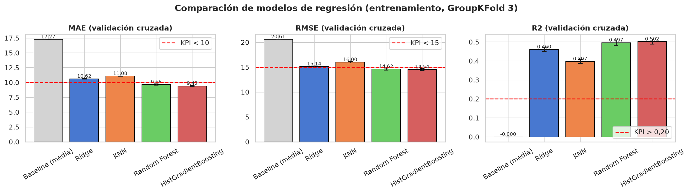

## 7.2 Clasificación: 4 modelos y comparación de métodos de balanceo

Se probaron **5 métodos de balanceo × 4 modelos** (más SMOTENC en HistGradientBoosting). El remuestreo se aplicó solo a los pliegues de entrenamiento.

| Método | F1 macro promedio | Recall "alto" promedio | Comentario |
|---|---:|---:|---|
| Sin balanceo | 0,603 | 0,217 | Alta accuracy, pero ignora la clase "alto" |
| `class_weight='balanced'` | **0,642** | 0,706 | Mejor promedio; no agranda los datos (no aplica a KNN) |
| Submuestreo (RUS) | 0,598 | **0,726** | Descarta ~70% de los datos; peor F1 |
| Sobremuestreo (ROS) | 0,618 | 0,672 | Mejor F1 en Random Forest y KNN |
| SMOTE | 0,614 | 0,638 | Mejor F1 en regresión logística y HistGradientBoosting |
| SMOTENC (solo HGB) | 0,660 | 0,448 | No supera a SMOTE (0,666) y tarda ~16× más |

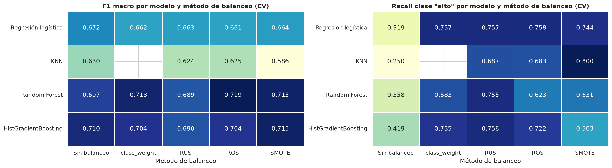

Cada modelo se ajustó con su mejor método (criterio: F1 macro en CV):

| Modelo | Balanceo | Mejores hiperparámetros | F1 macro CV | Recall "alto" CV |
|---|---|---|---:|---:|
| Baseline (clase mayoritaria) | — | — | 0,208 | 0,000 |
| **Regresión logística** | SMOTE | `C=1.0` | 0,620 | **0,716** |
| **KNN** | ROS | `k=25`, `weights=distance` | 0,550 | 0,634 |
| **Random Forest** | ROS | `max_features=0.2`, `min_samples_leaf=3` | **0,672** | 0,517 |
| **HistGradientBoosting** | SMOTE | `lr=0.03`, `max_iter=300`, `max_leaf_nodes=63` | 0,668 | 0,465 |

## 7.3 No supervisado 1 — K-Means: perfiles sonoros

- **Objetivo:** segmentar las canciones por **sonido** para crear playlists por contexto, identificar los perfiles con más tracción y contrastar el sonido con las etiquetas de género.
- **Variables:** las 9 de audio, estandarizadas (sin popularidad ni género).
- **Elección de k:** codo + silueta, dentro de un rango de negocio de 4 a 8 perfiles → **k = 7**.

| Perfil | Rasgos | % catálogo | Pop. media | % "alto" |
|---|---|---:|---:|---:|
| Bailables y alegres | bailabilidad 0,71, positividad 0,70 | 30,8% | 34,4 | **14,6%** |
| Intensas y ruidosas | energía 0,82, −5,4 dB, 140 BPM | 22,6% | 35,4 | 12,6% |
| Acústicas melódicas | acusticidad 0,69 | 20,2% | 33,4 | 10,9% |
| Electrónica instrumental | instrumentalidad 0,80, energía 0,74 | 11,3% | 27,4 | 3,6% |
| Ambientales / clásicas | acusticidad 0,87, −21 dB | 7,1% | 28,4 | 6,6% |
| En vivo | presencia en vivo 0,75 | 6,9% | 35,4 | 6,5% |
| Habladas | presencia de habla 0,84 | 1,2% | 24,5 | 1,3% |

La silueta es 0,198 en entrenamiento y 0,192 en prueba (los perfiles generalizan), y el ARI entre semillas es 0,996 (la solución es estable).

| | |
|---|---|
| 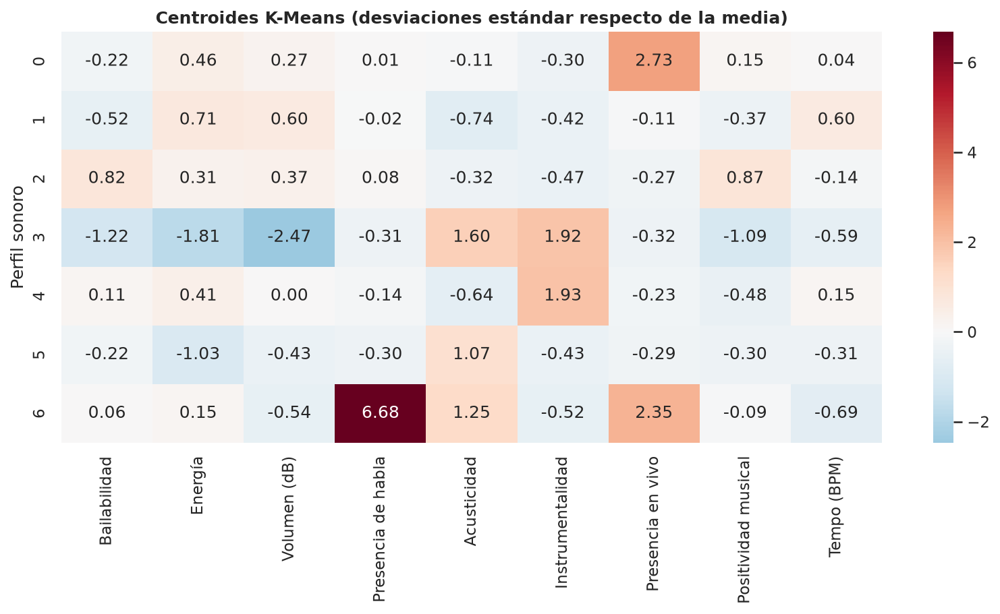 | 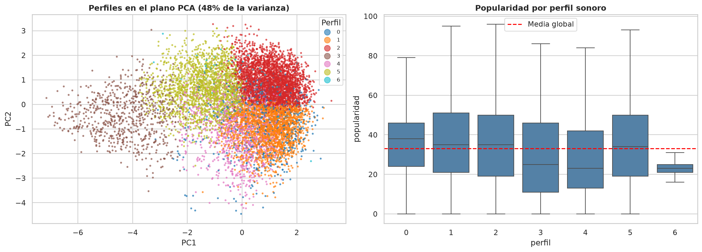 |

## 7.4 No supervisado 2 — Clustering jerárquico: familias de géneros

- **Objetivo:** reducir **114 géneros a familias** para organizar el catálogo, recomendar géneros afines y detectar etiquetas redundantes.
- **Método:** cada género se describe por su perfil de audio medio (calculado en entrenamiento) y se agrupa con Ward. Se eligen **11 familias** por silueta (0,274) dentro del rango 6–12.
- **Familias destacadas:**
  - ambiental/clásica (ambient, classical, piano, sleep, new-age);
  - metal extremo (black, death, grindcore);
  - electrónica de club (techno, house, minimal);
  - bailables/urbanas (hip-hop, reggaeton, k-pop, latin, edm);
  - música brasileña en vivo (pagode, samba, sertanejo);
  - comedia;
  - una gran familia pop/folk/cantautor de 33 géneros que **suenan casi igual**.
- **Ablación** (HGB, CV) para medir cuánta señal predictiva conserva cada representación del género:

| Representación del género | R² CV |
|---|---:|
| Sin género | 0,105 |
| 11 familias | 0,190 |
| 114 géneros | 0,383 |

  El valor predictivo del género es en gran parte cultural y se pierde al agruparlo por sonido.

| | |
|---|---|
| 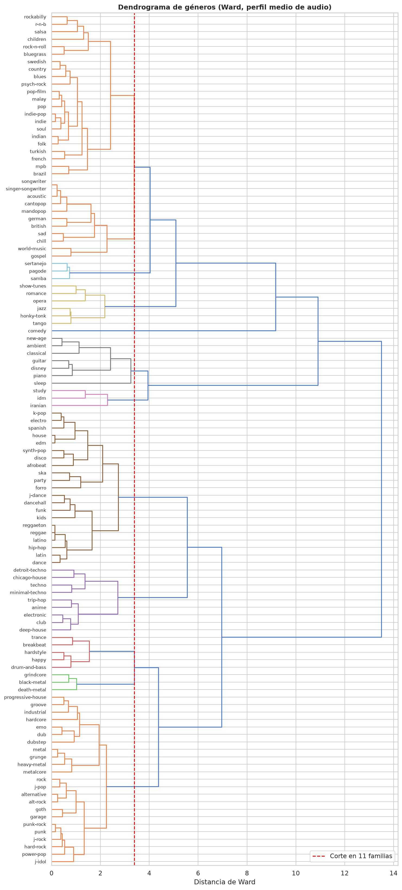 | 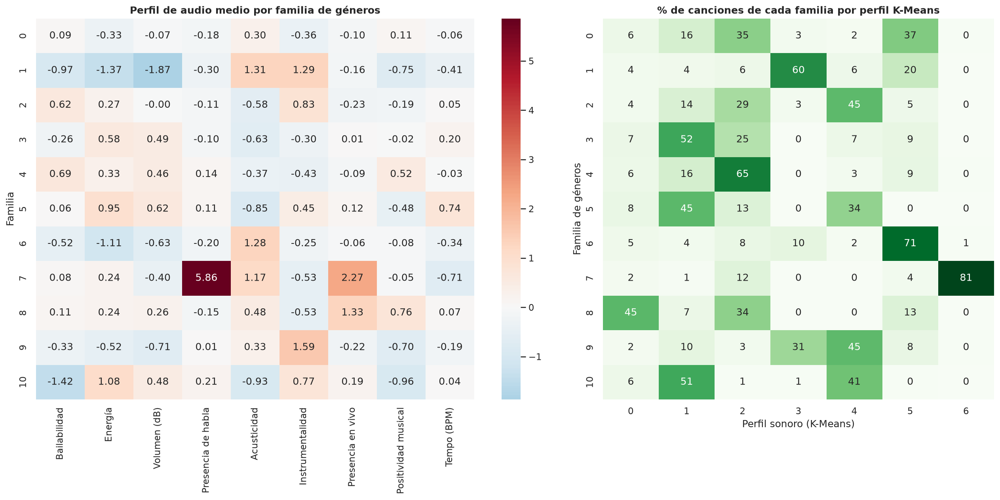 |

# 8. Evaluación (conjunto de prueba)

## 8.1 Regresión

| Modelo | MAE | RMSE | R² | Mejora MAE vs baseline |
|---|---:|---:|---:|---:|
| Baseline | 17,17 | 20,53 | 0,000 | — |
| Ridge | 11,86 | 16,53 | 0,352 | 30,9% |
| KNN | 13,09 | 17,96 | 0,235 | 23,8% |
| Random Forest | 11,06 | 15,79 | 0,409 | 35,6% |
| **HistGradientBoosting** | **11,05** | **15,77** | **0,410** | **35,6%** |

Las métricas de prueba coinciden con las de CV, así que **no hay sobreajuste**. El error se concentra en los extremos:

- las canciones con popularidad 0 se sobreestiman en ~25 puntos;
- los éxitos (≥ 61) se subestiman entre 23 y 41 puntos;
- en el rango 21–40, donde está la mayor parte del catálogo, el MAE es de 6 puntos.

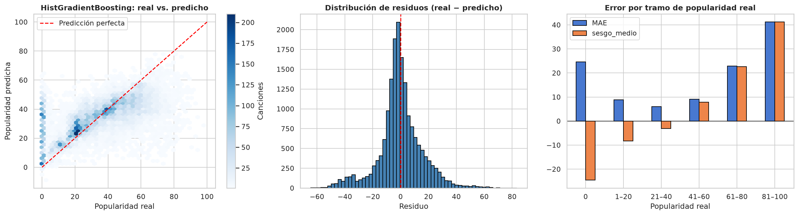

## 8.2 Clasificación

| Modelo | Accuracy | F1 macro | Recall "alto" | Precisión "alto" | ROC-AUC |
|---|---:|---:|---:|---:|---:|
| Baseline | 0,449 | 0,206 | 0,000 | 0,000 | 0,500 |
| Regresión logística + SMOTE | 0,670 | 0,625 | **0,709** | 0,324 | 0,853 |
| KNN + ROS | 0,609 | 0,569 | 0,655 | 0,276 | 0,793 |
| **Random Forest + ROS** | **0,738** | **0,678** | 0,505 | **0,487** | 0,879 |
| HistGradientBoosting + SMOTE | 0,736 | 0,673 | 0,493 | 0,474 | **0,881** |

- Con el mejor modelo (Random Forest), "bajo" y "medio" se reconocen bien (F1 ≈ 0,78 y 0,76).
- La clase "alto" se confunde sobre todo con "medio": los errores ocurren entre clases vecinas.
- **Lista corta:** ordenando por probabilidad de "alto", el **top 1% tiene 89% de aciertos**, el top 5% un 62% y el top 10% un 51% (tasa base: 11%).

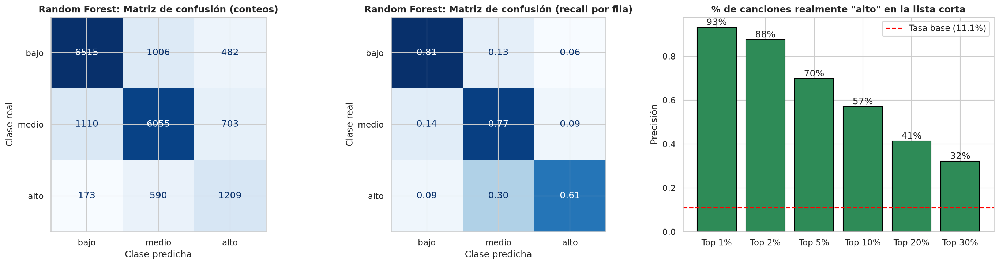

## 8.3 Importancia de variables y sesgo

- **Importancia por permutación:** el género, permutado como bloque, es por lejos la variable más importante (+7,2 de MAE al permutarlo). Le siguen instrumentalidad, acusticidad, energía, duración y volumen. Tonalidad, compás y tempo casi no aportan.
- **Sesgo por género:** el MAE va de **2,6** (gospel, forró) a **32,9** (electro, dance, house, edm), y en 23 de 114 géneros supera 1,5 veces el global. El error no depende de la popularidad media del género (r = 0,04), sino de su **heterogeneidad**: hay géneros que mezclan éxitos con reediciones de popularidad 0. Las predicciones en esos géneros deben usarse con mayor cautela.
- **Sesgo de la limpieza:** el género `sleep`, el más afectado por la limpieza de EP1, tiene un MAE de 10,7, similar al global. No se observa un perjuicio en el desempeño.

| | |
|---|---|
| 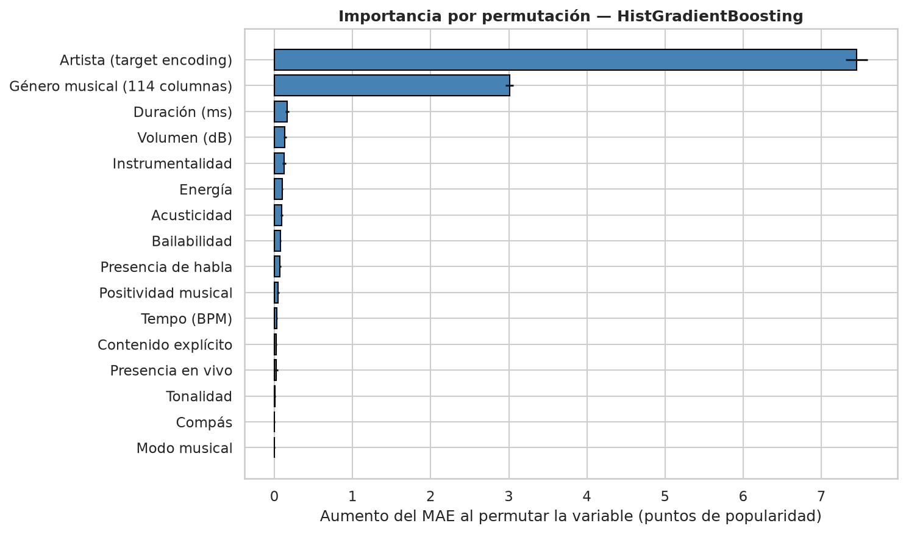 | 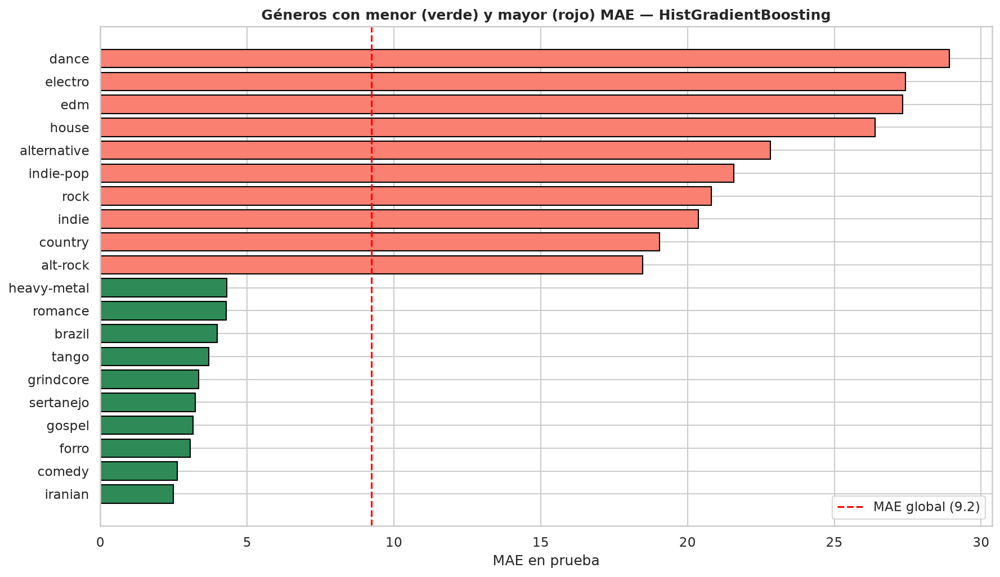 |

## 8.4 Recomendaciones para el negocio

1. **Usar el clasificador como filtro de priorización** para curadores: revisar primero el top 1–5% por probabilidad de "alto". Si el objetivo es no perder posibles éxitos, usar la regresión logística + SMOTE o bajar el umbral de decisión. **Siempre con revisión humana.**
2. **Usar el regresor** para estimar el nivel general de una canción, no para identificar éxitos puntuales.
3. **Usar los perfiles sonoros** para playlists por contexto (fiesta, foco, relajación) y las **familias de géneros** para la navegación y las recomendaciones del catálogo.
4. **Para mejorar los modelos:**
   - incorporar variables de artista (seguidores, historial), fecha de lanzamiento y exposición en playlists;
   - deduplicar las reediciones en la fuente.

# 9. Despliegue (propuesta)

`models/` contiene pipelines completos (preprocesamiento + modelo) serializados con `joblib`:

| Archivo | Contenido |
|---|---|
| `regresor_popularidad.joblib` | HistGradientBoosting (regresión) |
| `clasificador_popularidad.joblib` | Random Forest + ROS (clasificación) |
| `kmeans_perfiles_sonoros.joblib` | `StandardScaler` + K-Means (k = 7) |
| `familias_genero.joblib` | Mapeo género → familia |

```python
import joblib
modelo = joblib.load('models/clasificador_popularidad.joblib')
modelo.predict_proba(X_nuevo)  # mismas columnas que X (ver notebook, sección 3.13)
```

**Plan de monitoreo:**

- Recalcular MAE, F1 macro, recall de "alto" y error por género cada mes, con canciones cuya popularidad ya se observó.
- Vigilar la deriva de las variables de entrada.
- Reentrenar si el F1 macro cae más de 0,05 o aparecen géneros nuevos.

# 10. Ética, sesgos y privacidad

- **Ciclo de retroalimentación:** lo que se promociona se vuelve popular. Por eso el modelo debe usarse **solo como apoyo**, con supervisión humana.
- **Popularidad ≠ calidad artística.** El modelo no mide el mérito de un artista.
- **Sesgo de limpieza:** el 88% de las filas eliminadas por ceros de audio son del género `sleep`. Se evaluó su efecto en el desempeño y no se observa perjuicio.
- **Error desigual por género:** se reporta en la sección 8.3 y debe monitorearse.
- **Privacidad:** el dataset no contiene datos personales de usuarios, así que el riesgo es bajo. Si se incorporaran historiales de escucha, aplicarían minimización de datos y la normativa de protección de datos.

# 11. Estructura del proyecto

```text
machine-learning-spotify/
├── data/
│   ├── raw/Spotify_Tracks_Dataset.csv
│   └── processed/
│       ├── spotify_clean.csv, spotify_base_modelo.csv     # limpieza (EP1)
│       ├── spotify_multigenero.csv, particion_modelo.csv  # base de modelamiento EP2
│       ├── auditoria_faltantes.csv, balance_limpieza.csv, filas_descartadas.csv, ...
│       ├── resultados_cv_regresion.csv, resultados_test_regresion.csv
│       ├── resultados_balanceo.csv, resultados_cv_clasificacion.csv, resultados_test_clasificacion.csv
│       ├── familias_genero.csv, importancia_permutacion.csv, errores_por_genero.csv
│       └── kpis_ep2.csv
├── images/          # 00–05 EDA (EP1) · 06–17 modelamiento y evaluación (EP2)
├── models/          # pipelines serializados (joblib)
├── notebooks/
│   ├── EP1_Spotify_CRISP_DM_COMPLETO.ipynb    # entrega EP1 (histórico)
│   └── EP2_Spotify_CRISP_DM_Modelado.ipynb    # notebook completo y ejecutable (Fases 1–6)
├── requirements.txt
└── README.md
```

# 12. Ejecución

```bash
git clone https://github.com/ritnight/machine-learning-spotify
cd machine-learning-spotify
pip install -r requirements.txt
jupyter notebook notebooks/EP2_Spotify_CRISP_DM_Modelado.ipynb
```

Ejecutar con **Restart Kernel and Run All**. La ejecución completa toma ~40 minutos en 4 núcleos, sobre todo por la validación cruzada. Para una ejecución más rápida, poner `EJECUTAR_SMOTENC = False` (sección 4.3.1). En Google Colab, subir el CSV y configurar `RUTA_DATOS` en la sección 2.1.

> El notebook EP2 regenera `spotify_multigenero.csv` y `particion_modelo.csv` con la nueva partición por artista + título. Si se vuelve a ejecutar el notebook EP1, esos dos archivos vuelven a su versión anterior.

---

**Duoc UC — 2026 · Machine Learning (MLY1101) · Evaluación Parcial N.º 2 · Caso C**
